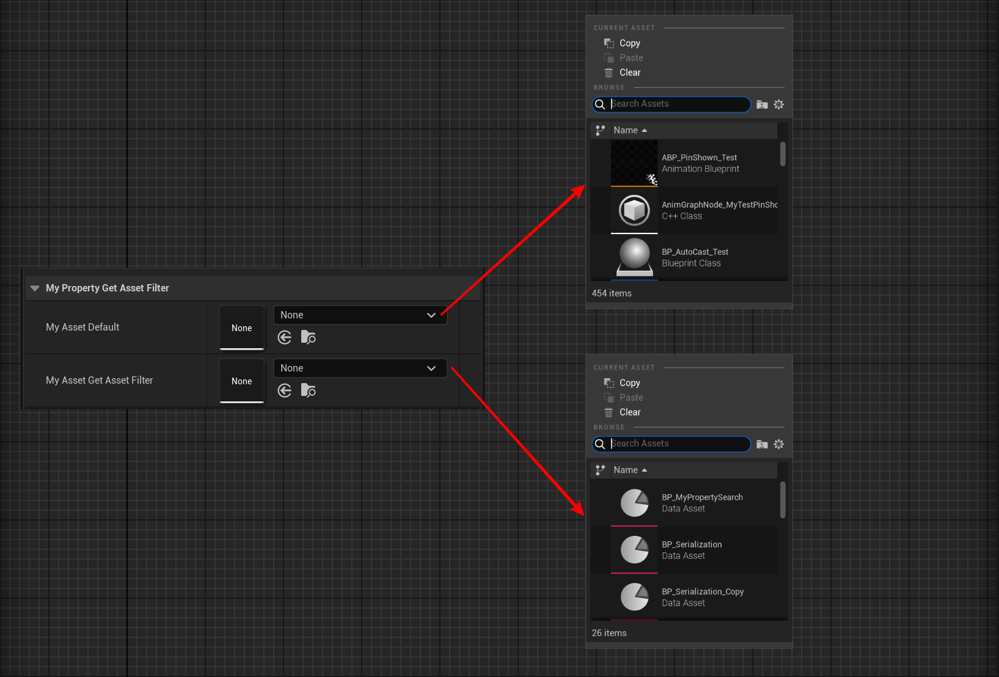

# GetAssetFilter

- **功能描述：** 指定一个UFUNCTION来对UObject*属性的可选资源进行排除过滤。
- **使用位置：** UPROPERTY
- **引擎模块：** Asset Property
- **元数据类型：** string="abc"
- **限制类型：** UObject*
- **常用程度：** ★★★

指定一个UFUNCTION来对UObject*属性的可选资源进行排除过滤。

- 指定的函数名字必须是UFUNCTION，在本类中定义。
- 函数的原型是bool FuncName(const FAssetData& AssetData) const;，返回true来排除掉该资产。
- 这是一种让用户自定义资产过滤的方式。

## 测试代码：

```cpp
UCLASS(Blueprintable, BlueprintType)
class INSIDER_API UMyProperty_GetAssetFilter :public UDataAsset
{
public:
	GENERATED_BODY()
public:
	UPROPERTY(EditAnywhere, BlueprintReadWrite)
	UObject* MyAsset_Default;
	UPROPERTY(EditAnywhere, BlueprintReadWrite, meta = (GetAssetFilter = "IsShouldFilterAsset"))
	UObject* MyAsset_GetAssetFilter;
public:
	UFUNCTION()
	bool IsShouldFilterAsset(const FAssetData& AssetData)
	{
		return !AssetData.IsInstanceOf<UDataAsset>();
	}
};
```

## 测试效果：

可以见到，MyAsset_GetAssetFilter进行过滤后只允许DataAsset类型的资产。



## 原理：

在SPropertyEditorAsset（对应UObject类型属性）中有判断GetAssetFilter的meta，得到函数并附加到资产排除的回调里去。

```cpp
void SPropertyEditorAsset::Construct(const FArguments& InArgs, const TSharedPtr<FPropertyEditor>& InPropertyEditor)
{
	if (Property && Property->GetOwnerProperty()->HasMetaData("GetAssetFilter"))
{
	// Add MetaData asset filter
	const FString GetAssetFilterFunctionName = Property->GetOwnerProperty()->GetMetaData("GetAssetFilter");
	if (!GetAssetFilterFunctionName.IsEmpty())
	{
		TArray<UObject*> ObjectList;
		if (PropertyEditor.IsValid())
		{
			PropertyEditor->GetPropertyHandle()->GetOuterObjects(ObjectList);
		}
		else if (PropertyHandle.IsValid())
		{
			PropertyHandle->GetOuterObjects(ObjectList);
		}
		for (UObject* Object : ObjectList)
		{
			const UFunction* GetAssetFilterFunction = Object ? Object->FindFunction(*GetAssetFilterFunctionName) : nullptr;
			if (GetAssetFilterFunction)
			{
				AppendOnShouldFilterAssetCallback(FOnShouldFilterAsset::CreateUFunction(Object, GetAssetFilterFunction->GetFName()));
			}
		}
	}
}
}
```
