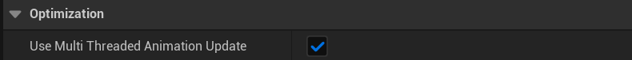

# BlueprintThreadSafe

功能描述: 用在类上或函数上，标记类里的函数都是线程安全的。
这样就可以在动画蓝图等非游戏线程被调用了。
使用位置: UCLASS, UFUNCTION
Feature: Blueprint
引擎模块: Blueprint
元数据类型: bool
限制类型: 从实践上，类一般是BlueprintFunctionLibrary
Status: Done
Sub-item: NotBlueprintThreadSafe (NotBlueprintThreadSafe.md)
常用程度: 3

动画蓝图的AimGraph默认是开启线程安全Update的。设置在ClassSettings里（默认是打开的）



可参考官方文档的**CPU Thread Usage and Performance这一节**

[Graphing in Animation Blueprints](https://docs.unrealengine.com/5.3/en-US/graphing-in-animation-blueprints-in-unreal-engine/#cputhreadusageandperformance)

因此AimGraph里的函数要求都得是线程安全的。你的C++函数或者是蓝图里蓝图库里的函数都需要手动标记为ThreadSafe，默认不带ThreadSafe标记的都是不线程安全的。

在蓝图里，如果在蓝图函数面板中勾上ThreadSafe，这个函数的对象会设置bThreadSafe=True，从而在编译生成的BlueprintGeneratedClass上面设置(BlueprintThreadSafe = true)


测试蓝图函数库：

同样的函数，一个打开ThreadSafe，一个没有。没有的那个函数在动画蓝图的AnimGraph里使用的时候，在编译的时候就会触发警告。


测试结果：


在C++里，C++的测试代码：

```cpp
//(BlueprintThreadSafe = , IncludePath = Class/Blueprint/MyClass_ThreadSafe.h, ModuleRelativePath = Class/Blueprint/MyClass_ThreadSafe.h)
UCLASS(meta=(BlueprintThreadSafe))
class INSIDER_API UMyBlueprintFunctionLibrary_ThreadSafe : public UBlueprintFunctionLibrary
{
	GENERATED_BODY()
public:
	UFUNCTION(BlueprintPure)
	static float MyFunc_ClassThreadSafe_Default(float value) {return value+100;}

	//(ModuleRelativePath = Class/Blueprint/MyClass_ThreadSafe.h, NotBlueprintThreadSafe = )
	UFUNCTION(BlueprintPure,meta=(NotBlueprintThreadSafe))
	static float MyFunc_ClassThreadSafe_FuncNotThreadSafe(float value) {return value+100;}
};

UCLASS()
class INSIDER_API UMyBlueprintFunctionLibrary_NoThreadSafe : public UBlueprintFunctionLibrary
{
	GENERATED_BODY()
public:
	//(BlueprintThreadSafe = , ModuleRelativePath = Class/Blueprint/MyClass_ThreadSafe.h)
	UFUNCTION(BlueprintPure,meta=(BlueprintThreadSafe))
	static float MyFunc_ClassDefault_FuncThreadSafe(float value) {return value+100;}

	//(ModuleRelativePath = Class/Blueprint/MyClass_ThreadSafe.h, NotBlueprintThreadSafe = )
	UFUNCTION(BlueprintPure,meta=(NotBlueprintThreadSafe))
	static float MyFunc_ClassDefault_FuncNotThreadSafe(float value) {return value+100;}
};

UCLASS()
class INSIDER_API UMyBlueprintFunctionLibrary_Default : public UBlueprintFunctionLibrary
{
	GENERATED_BODY()
public:
	UFUNCTION(BlueprintPure)
	static float MyFunc_ClassDefault_FuncDefault(float value) {return value+100;}
};
```

动画蓝图的测试效果：


解析原理：

```cpp
bool FBlueprintEditorUtils::HasFunctionBlueprintThreadSafeMetaData(const UFunction* InFunction)
{
	if(InFunction)
	{
		const bool bHasThreadSafeMetaData = InFunction->HasMetaData(FBlueprintMetadata::MD_ThreadSafe);
		const bool bHasNotThreadSafeMetaData = InFunction->HasMetaData(FBlueprintMetadata::MD_NotThreadSafe);
		const bool bClassHasThreadSafeMetaData = InFunction->GetOwnerClass() && InFunction->GetOwnerClass()->HasMetaData(FBlueprintMetadata::MD_ThreadSafe);

		// Native functions need to just have the correct class/function metadata
		const bool bThreadSafeNative = InFunction->HasAnyFunctionFlags(FUNC_Native) && (bHasThreadSafeMetaData || (bClassHasThreadSafeMetaData && !bHasNotThreadSafeMetaData));

		// Script functions get their flag propagated from their entry point, and dont pay heed to class metadata
		const bool bThreadSafeScript = !InFunction->HasAnyFunctionFlags(FUNC_Native) && bHasThreadSafeMetaData;
		
		return bThreadSafeNative || bThreadSafeScript;
	}
	
	return false;
}
```

可以从逻辑上看出，如果在UCLASS上带上了BlueprintThreadSafe，则其内部的函数就默认是线程安全，除非特意手动加上NotBlueprintThreadSafe来排除。而如果UCLASS上没有标记，则需一个个手动的在UFUNCTION上标记BlueprintThreadSafe。两种方式都可以。

注意UCLASS(meta=(NotBlueprintThreadSafe))这种是没有被识别判断的，因此并没有什么意义。