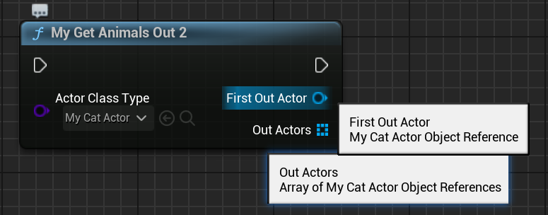

# DeterminesOutputType

- **功能描述：** 指定一个参数的类型作为函数动态调整输出参数类型的参考类型
- **使用位置：** UFUNCTION
- **引擎模块：** Blueprint
- **元数据类型：** string="abc"
- **限制类型：** Class或Object指针类型，或容器类型
- **关联项：** [DynamicOutputParam](../DynamicOutputParam.md)
- **常用程度：** ★★★

指定一个参数的类型作为函数输出参数的类型。

假定这么一个函数原型：

```cpp
	UFUNCTION(BlueprintCallable, meta = (DeterminesOutputType = "A",DynamicOutputParam="P1,P2"))
	TypeR MyFunc(TypeA A,Type1 P1,Type2 P2,Type3 P3);
```

DeterminesOutputType的值指定了一个函数参数名称，即A。其TypeA的类型必须是Class或Object，一般是TSubClassOf<XXX> 或者XXX* ，当然也可以是TArray<XXX*>，还可以是指向参数结构里的某个属性。如Args_ActorClassType。TSoftObjectPtr<XXX>也是可以的，指向一个子类Asset对象，然后输出的基类Asset*就可以相应改变。

所谓输出参数包括返回值和函数的输出参数，因此上述函数原型里的TypeR,P1,P2都是输出参数。为了让输出参数的类型也相应变化，TypeR、Type1和Type2的类型也得是Class或Object类型，且A参数在蓝图节点上实际选择的类型必须是输出参数类型的子类，这样才能自动转换过去。

如果没有P1和P2，只把返回值当作TypeR，则可以不指定DynamicOutputParam也可以自动默认把返回值当作动态的输出参数。否则则需要手动书写DynamicOutputParam来指定哪些函数参数来支持动态类型。

## 测试代码：

```cpp

UCLASS(Blueprintable, BlueprintType)
class INSIDER_API AMyAnimalActor :public AActor
{
public:
	GENERATED_BODY()
};

UCLASS(Blueprintable, BlueprintType)
class INSIDER_API AMyCatActor :public AMyAnimalActor
{
public:
	GENERATED_BODY()
};

UCLASS(Blueprintable, BlueprintType)
class INSIDER_API AMyDogActor :public AMyAnimalActor
{
public:
	GENERATED_BODY()
};

USTRUCT(BlueprintType)
struct FMyOutputTypeArgs
{
	GENERATED_BODY()
public:
	UPROPERTY(BlueprintReadWrite, EditAnywhere)
	int32 MyInt = 1;
	UPROPERTY(BlueprintReadWrite, EditAnywhere)
	TSubclassOf<AMyAnimalActor> ActorClassType;
};

UCLASS(Blueprintable, BlueprintType)
class INSIDER_API UMyFunctionLibrary_OutputTypeTest :public UBlueprintFunctionLibrary
{
public:
	GENERATED_BODY()
public:
	//class
	UFUNCTION(BlueprintCallable, meta = (DeterminesOutputType = "ActorClassType"))
	static TArray<AActor*> MyGetAnimals(TSubclassOf<AMyAnimalActor> ActorClassType);

	//have to add DynamicOutputParam
	UFUNCTION(BlueprintCallable, meta = (DeterminesOutputType = "ActorClassType", DynamicOutputParam = "OutActors"))
	static void MyGetAnimalsOut(TSubclassOf<AMyAnimalActor> ActorClassType, TArray<AActor*>& OutActors);

	//have to add DynamicOutputParam
	UFUNCTION(BlueprintCallable, meta = (DeterminesOutputType = "ActorClassType", DynamicOutputParam = "FirstOutActor,OutActors"))
	static void MyGetAnimalsOut2(TSubclassOf<AMyAnimalActor> ActorClassType, AActor*& FirstOutActor, TArray<AActor*>& OutActors);

	//object
	UFUNCTION(BlueprintCallable, meta = (DeterminesOutputType = "ExampleActor"))
	static TArray<AActor*> MyGetAnimalsWithActor(AMyAnimalActor* ExampleActor);

	UFUNCTION(BlueprintCallable, meta = (DeterminesOutputType = "ExampleActorArray"))
	static TArray<AActor*> MyGetAnimalsWithActorArray(TArray<AMyAnimalActor*> ExampleActorArray);

	//struct property
	UFUNCTION(BlueprintCallable, meta = (DeterminesOutputType = "Args_ActorClassType"))
	static TArray<AActor*> MyGetAnimalsWithStructProperty(const FMyOutputTypeArgs& Args);
};

```

## 蓝图中效果：

用返回值当作输出参数的例子，注意到返回值类型实际变成了TArray<AMyCatActor*>。


也可以加上DynamicOutputParam来指定输出参数作为动态类型参数：


DynamicOutputParam可以指定多个参数



DeterminesOutputType 的参数类型也可以是Object或者Object的容器：


DeterminesOutputType 的参数甚至可以是结构里的某个属性，但是只有SplitStruct的时候才生效，因为这个时候结构的属性变量才变成函数的Pin，才可以进行DeterminesOutputType的名称比对。这个时候要书写成“A_B”，而不是“A.B”。


## 原理：

DeterminesOutputType的作用机制是根据这个名称去函数蓝图节点上查找Pin，这个Pin得是Class或Object类型的（容器也行），因为必须是这二者才支持指针类型的转换。这个Pin在蓝图节点上是会由各种TypePicker来实际指定值，比如ClassPicker或ObjectPicker。之后根据TypePicker选择的值，就可以相应的调整DynamicOutputParam指定的参数的类型（或返回参数），真正发挥类型改变的是

Pin->PinType.PinSubCategoryObject = PickedClass;这一句。

```cpp
void FDynamicOutputHelper::ConformOutputType() const
{
	if (IsTypePickerPin(MutatingPin))
	{
		UClass* PickedClass = GetPinClass(MutatingPin);
		UK2Node_CallFunction* FuncNode = GetFunctionNode();

		// See if there is any dynamic output pins
		TArray<UEdGraphPin*> DynamicPins;
		GetDynamicOutPins(FuncNode, DynamicPins);
		
		// Set the pins class
		for (UEdGraphPin* Pin : DynamicPins)
		{
			if (ensure(Pin != nullptr))
		{
					Pin->PinType.PinSubCategoryObject = PickedClass;//设定每个动态参数的子类型
			}
		}
	}
}
```
