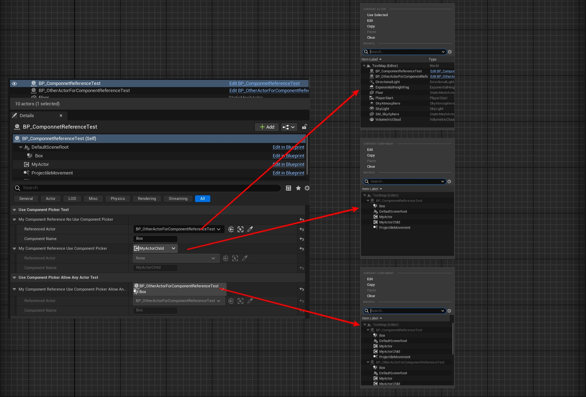

# UseComponentPicker

- **功能描述：** 用在ComponentReference属性上，使得选取器的列表里展示出Actor属下的Component以便选择。
- **使用位置：** UPROPERTY
- **引擎模块：** Component Property
- **元数据类型：** bool
- **限制类型：** FComponentReference，FSoftComponentReference
- **关联项：** [AllowAnyActor](../AllowAnyActor.md)
- **常用程度：** ★★

用在ComponentReference属性上，使得选取器的列表里展示出Actor属下的Component以便选择。

- 默认情况下，FComponentReference的Referenced Actor属性展开的选择器列表是让你选择场景里的Actor，因此并不会把该Actor下的组件也都显示出来。而ComponentReference下的ComponentName属性需要玩家手动填写。这种方式比较原始，也容易出错。
- 因此加上UseComponentPicker后，就可以显示出组件列表来选择。但是又默认限制是当前Actor属下的所有组件，不包括场景里其他Actor里的组件。
- 如果想要进一步把场景里所有Actor下的所有组件都列出来，则需要进一步加上AllowAnyActor，以扩大筛选范围。
- ComponentReference的属性类型有两种，FComponentReference和FSoftComponentReference，二者都对应了FComponentReferenceCustomization。测试代码为简洁就没有列出FSoftComponentReference。

## 测试代码：

```cpp
	UPROPERTY(EditInstanceOnly, BlueprintReadWrite, Category = "UseComponentPickerTest")
	FComponentReference MyComponentReference_NoUseComponentPicker;

	UPROPERTY(EditInstanceOnly, BlueprintReadWrite, Category = "UseComponentPickerTest", meta = (UseComponentPicker))
	FComponentReference MyComponentReference_UseComponentPicker;

	UPROPERTY(EditInstanceOnly, BlueprintReadWrite, Category = "UseComponentPicker_AllowAnyActor_Test", meta = (UseComponentPicker,AllowAnyActor))
	FComponentReference MyComponentReference_UseComponentPicker_AllowAnyActor;
```

## 测试效果：

- 可见默认的第一个列出了所有Actor，但是ComponentName需要手写。
- 第二个加上UseComponentPicker后，列出了当前Actor下的所有组件，但是不能选择到其他Actor的组件。
- 第三个继续加上AllowAnyActor后，列出了所有Actor的所有组件。



## 原理:

FComponentReference和FSoftComponentReference，二者都对应了FComponentReferenceCustomization。看源码可发现用上bUseComponentPicker后，会专门创建ClassFilters和ComboBox，就是采用不同的类型过滤器和不同的UI来选择组件。否则else分支就是很朴素的结构属性展开编辑。

```cpp
void FComponentReferenceCustomization::CustomizeHeader(TSharedRef<IPropertyHandle> InPropertyHandle, FDetailWidgetRow& HeaderRow, IPropertyTypeCustomizationUtils& CustomizationUtils)
{
	PropertyHandle = InPropertyHandle;

	CachedComponent.Reset();
	CachedFirstOuterActor.Reset();
	CachedPropertyAccess = FPropertyAccess::Fail;

	bAllowClear = false;
	bAllowAnyActor = false;
	bUseComponentPicker = PropertyHandle->HasMetaData(NAME_UseComponentPicker);
	bIsSoftReference = false;

	if (bUseComponentPicker)
	{
		FProperty* Property = InPropertyHandle->GetProperty();
		check(CastField<FStructProperty>(Property) &&
				(FComponentReference::StaticStruct() == CastFieldChecked<const FStructProperty>(Property)->Struct ||
				FSoftComponentReference::StaticStruct() == CastFieldChecked<const FStructProperty>(Property)->Struct));

		bAllowClear = !(InPropertyHandle->GetMetaDataProperty()->PropertyFlags & CPF_NoClear);
		bAllowAnyActor = InPropertyHandle->HasMetaData(NAME_AllowAnyActor);
		bIsSoftReference = FSoftComponentReference::StaticStruct() == CastFieldChecked<const FStructProperty>(Property)->Struct;

		BuildClassFilters();
		BuildComboBox();

		InPropertyHandle->SetOnPropertyValueChanged(FSimpleDelegate::CreateSP(this, &FComponentReferenceCustomization::OnPropertyValueChanged));

		// set cached values
		{
			CachedComponent.Reset();
			CachedFirstOuterActor = GetFirstOuterActor();

			FComponentReference TmpComponentReference;
			CachedPropertyAccess = GetValue(TmpComponentReference);
			if (CachedPropertyAccess == FPropertyAccess::Success)
			{
				CachedComponent = TmpComponentReference.GetComponent(CachedFirstOuterActor.Get());
				if (!IsComponentReferenceValid(TmpComponentReference))
				{
					CachedComponent.Reset();
				}
			}
		}

		HeaderRow.NameContent()
		[
			InPropertyHandle->CreatePropertyNameWidget()
		]
		.ValueContent()
		[
			ComponentComboButton.ToSharedRef()
		]
		.IsEnabled(MakeAttributeSP(this, &FComponentReferenceCustomization::CanEdit));
	}
	else
	{
		HeaderRow.NameContent()
		[
			InPropertyHandle->CreatePropertyNameWidget()
		]
		.ValueContent()
		[
			InPropertyHandle->CreatePropertyValueWidget()
		]
		.IsEnabled(MakeAttributeSP(this, &FComponentReferenceCustomization::CanEdit));
	}
}
```
