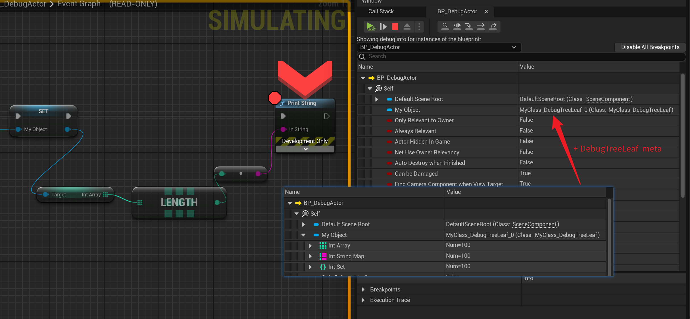

# DebugTreeLeaf

- **功能描述：** 阻止BlueprintDebugger展开该类的属性以加速编辑器里调试器的性能
- **使用位置：** UCLASS
- **引擎模块：** Debug
- **元数据类型：** bool
- **常用程度：** ★

阻止BlueprintDebugger展开该类的属性以加速编辑器里调试器的性能。当一个类拥有过多的属性（或递归嵌套太多属性）的时候，BlueprintDebugger在展示该类的属性数据的时候便会消耗过多的性能，造成编辑器卡顿。因此对于这种类，我们可以手动的加上该标志来阻止继续展开属性树，只到此为止。因此顾名思义，本类变成了调试时属性树的叶子。

在源码中只有UAnimDataModel用到了该标记，不过我们也可以在自己的类上加上该标记，当它拥有非常多的属性并且又不想调试它的数据的时候。

## 测试代码：

```cpp

UCLASS(BlueprintType, meta = (DebugTreeLeaf))
class INSIDER_API UMyClass_DebugTreeLeaf :public UObject
{
	GENERATED_BODY()
	UMyClass_DebugTreeLeaf();
public:
	UPROPERTY(BlueprintReadWrite)
	TArray<int32> IntArray;
	UPROPERTY(BlueprintReadWrite)
	TMap<int32, FString> IntStringMap;
	UPROPERTY(BlueprintReadWrite)
	TSet<int32> IntSet;
};

```

## 蓝图中的效果：

UMyClass_DebugTreeLeaf对象作为一个类的成员变量（或者其他），在蓝图中调试查看变量，开启BlueprintDebugger查看变量属性时。如果没有加上DebugTreeLeaf，则会默认的展开所有内部属性。而如果加上DebugTreeLeaf标志，则会停止递归，阻止属性变量的展开。


