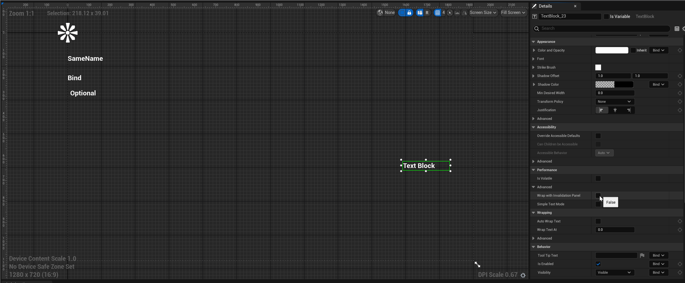

# DesignerRebuild

Description: 指定Widget里的某个属性值改变后应该重新刷新UMG的预览界面。
Usage: UPROPERTY
Feature: UMG
Group: Widget Property
Type: bool
LimitedType: UWidget子类里属性
Example: UPROPERTY(meta=(DesignerRebuild))
Status: Done

指定Widget里的某个属性值改变后应该重新刷新UMG的预览界面。

首先想到的问题是，哪种属性需要用到该DesignerRebuild标记？

这个属性很少需要用到，一般Widget里的属性在更新后也只需要更新自己的显示，不需要刷新整个界面，比如字号。需要用到的情况想来有二：

1. 一些属性的改变会大大的改变其控件样式，当然也可以做到精细化的只重绘自己，但干脆整个预览界面刷新一下得了，反正是编辑器环境。比如UTextBlock 的bSimpleTextMode，和UListViewBase 下的EntryWidgetClass，都会大大的改变自己。
2. 一些属性可能影响到整个界面别的东西的时候，这个时候也时候干脆全部刷新一下。没找到恰当的例子，但如果用户自己的控件有这个需求，就可以标上。

源码里的例子是：

```cpp

UCLASS(meta=(DisplayName="Text"), MinimalAPI)
class UTextBlock : public UTextLayoutWidget
{
	/**
	 * If this is enabled, text shaping, wrapping, justification are disabled in favor of much faster text layout and measurement.
	 * This feature is only suitable for "simple" text (ie, text containing only numbers or basic ASCII) as it disables the complex text rendering support required for certain languages (such as Arabic and Thai).
	 * It is significantly faster for text that can take advantage of it (particularly if that text changes frequently), but shouldn't be used for localized user-facing text.
	 */
	UPROPERTY(EditAnywhere, BlueprintReadOnly, Category=Performance, AdvancedDisplay, meta=(AllowPrivateAccess = "true", DesignerRebuild))
	bool bSimpleTextMode;
}

UCLASS(Abstract, NotBlueprintable, hidedropdown, meta = (EntryInterface = UserListEntry), MinimalAPI)
class UListViewBase : public UWidget
{
	UPROPERTY(EditAnywhere, BlueprintReadOnly, Category = ListEntries, meta = (DesignerRebuild, AllowPrivateAccess = true, MustImplement = "/Script/UMG.UserListEntry"))
	TSubclassOf<UUserWidget> EntryWidgetClass;
}
```

UTextBlock的测试效果：

可以发现在改变bSimpleTextMode的时候，左侧预览界面会一下下的在跳动刷新。而在点击改变别的按钮的时候就没有该效果。



测试代码：

```cpp
UCLASS(BlueprintType)
class INSIDER_API UMyProperty_BindWidget :public UUserWidget
{
public:
	UPROPERTY(EditAnywhere, Category = Design)
	int32 MyInt = 123;

	UPROPERTY(EditAnywhere, Category = Design, meta = (DesignerRebuild))
	int32 MyInt_DesignerRebuild = 123;
}
```

测试效果：

可见在改变普通的属性MyInt 的时候，界面并不会刷新。而在改变MyInt_DesignerRebuild 的时候，界面左上角的数字在跳动（虽然整个界面其实并没有什么实质变化）。


原理：

在Widget里的带有DesignerRebuild的某属性改变之后，会通知InvalidatePreview以便更新编辑器里的预览窗口。

```cpp

void SWidgetDetailsView::NotifyPostChange(const FPropertyChangedEvent& PropertyChangedEvent, FEditPropertyChain* PropertyThatChanged)
{
	const static FName DesignerRebuildName("DesignerRebuild");

	//...
	// If the property that changed is marked as "DesignerRebuild" we invalidate
	// the preview.
	if ( PropertyChangedEvent.Property->HasMetaData(DesignerRebuildName) || PropertyThatChanged->GetActiveMemberNode()->GetValue()->HasMetaData(DesignerRebuildName) )
	{
		const bool bViewOnly = true;
		BlueprintEditor.Pin()->InvalidatePreview(bViewOnly);
	}
}
```