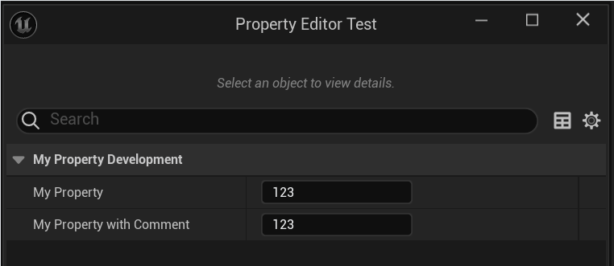

# Comment

- **功能描述：** 用来记录注释的内容
- **使用位置：** Any
- **引擎模块：** Development
- **元数据类型：** string="abc"
- **常用程度：** ★★★

Comment跟ToolTip不同，后者是用户鼠标悬停上的提示，前者只是简单的代码中的注释的记录。但是一般我们在代码里写上的注释，会自动也加到ToolTip 上，因此我们往往也会看到UI界面上的提示。

但如果不想要ToolTip，想只有Comment，则也可以自己手动在meta里添加。

## 测试代码：

```cpp
//(BlueprintType = true, Comment = //This is a comment on class, IncludePath = Property/Development/MyProperty_Development.h, ModuleRelativePath = Property/Development/MyProperty_Development.h, ToolTip = This is a comment on class)

//This is a comment on class
UCLASS(BlueprintType)
class INSIDER_API UMyProperty_Development :public UObject
{
	GENERATED_BODY()
public:
	//(Comment = //This is a comment on function, ModuleRelativePath = Property/Development/MyProperty_Development.h, ToolTip = This is a comment on function)
	
	//This is a comment on function
	UFUNCTION(BlueprintCallable)
	int32 MyFunc(FString str){return 0;}

	//	(Category = MyProperty_Development, Comment = //This is a comment on property, ModuleRelativePath = Property/Development/MyProperty_Development.h, ToolTip = This is a comment on property)
	 
	//This is a comment on property
	UPROPERTY(EditAnywhere, BlueprintReadWrite)
	int32 MyProperty = 123;

	//(Category = MyProperty_Development, Comment = This is my other property., ModuleRelativePath = Property/Development/MyProperty_Development.h)

	UPROPERTY(EditAnywhere, BlueprintReadWrite,meta=(Comment="This is my other property."))
	int32 MyProperty_WithComment = 123;
};

```

## 测试结果：

MyProperty_WithComment是单独只加的Comment，就没有了鼠标悬停效果。


