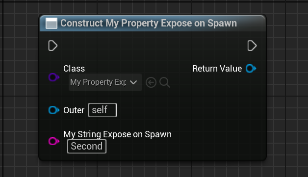

# ExposeOnSpawn

Description: 使该属性在ContructObject或SpawnActor等创建对象的时候暴露出来。
Usage: UPROPERTY
Feature: Blueprint
Group: Blueprint
Type: bool
Example: ExposeOnSpawn="true”
Status: Done

使该属性在ContructObject或SpawnActor等创建对象的时候暴露出来。

- 具体来说，通过在源码搜索，这个标记在UK2Node_AddComponent，UK2Node_ConstructObjectFromClass，UK2Node_SpawnActor，UK2Node_LatentGameplayTaskCall的时候用到。
- 在C++里设置的效果等同于在蓝图里勾上ExposeOnSpawn。
- 该meta的设置也会同时设置到PropertyFlags里的CPF_ExposeOnSpawn

测试代码：

```cpp

UCLASS(BlueprintType)
class INSIDER_API UMyProperty_ExposeOnSpawn :public UObject
{
	GENERATED_BODY()
public:
	//	(Category = MyProperty_ExposeOnSpawn, ModuleRelativePath = Property/Blueprint/MyProperty_ExposeOnSpawn.h)
	//	PropertyFlags:	CPF_Edit | CPF_BlueprintVisible | CPF_ZeroConstructor | CPF_HasGetValueTypeHash | CPF_NativeAccessSpecifierPublic 

	UPROPERTY(EditAnywhere, BlueprintReadWrite)
	FString MyString = TEXT("First");

	//	(Category = MyProperty_ExposeOnSpawn, ExposeOnSpawn = , ModuleRelativePath = Property/Blueprint/MyProperty_ExposeOnSpawn.h)
	//	PropertyFlags:	CPF_Edit | CPF_BlueprintVisible | CPF_ZeroConstructor | CPF_ExposeOnSpawn | CPF_HasGetValueTypeHash | CPF_NativeAccessSpecifierPublic 
	UPROPERTY(EditAnywhere, BlueprintReadWrite, meta = (ExposeOnSpawn))
	FString MyString_ExposeOnSpawn = TEXT("Second");
};
```

测试效果：

可见MyString_ExposeOnSpawn 暴露了出来，而MyString 没有。



原理：
在UHT的时候会分析如果包含ExposeOnSpawn就会同步设置CPF_ExposeOnSpawn。

而在IsPropertyExposedOnSpawn这个函数里具体判断是否要暴露，这个函数被上述的4个函数节点引用。源码里举UK2Node_ConstructObjectFromClass里的CreatePinsForClass作为例子，可见只有bIsExposedToSpawn 的时候才会为蓝图节点开始创建额外的Pin引脚。

```cpp
if (propertySettings.MetaData.ContainsKey(UhtNames.ExposeOnSpawn))
{
	propertySettings.PropertyFlags |= EPropertyFlags.ExposeOnSpawn;
}

bool UEdGraphSchema_K2::IsPropertyExposedOnSpawn(const FProperty* Property)
{
	Property = FBlueprintEditorUtils::GetMostUpToDateProperty(Property);
	if (Property)
	{
		const bool bMeta = Property->HasMetaData(FBlueprintMetadata::MD_ExposeOnSpawn);
		const bool bFlag = Property->HasAllPropertyFlags(CPF_ExposeOnSpawn);
		if (bMeta != bFlag)
		{
			const FCoreTexts& CoreTexts = FCoreTexts::Get();

			UE_LOG(LogBlueprint, Warning
				, TEXT("ExposeOnSpawn ambiguity. Property '%s', MetaData '%s', Flag '%s'")
				, *Property->GetFullName()
				, bMeta ? *CoreTexts.True.ToString() : *CoreTexts.False.ToString()
				, bFlag ? *CoreTexts.True.ToString() : *CoreTexts.False.ToString());
		}
		return bMeta || bFlag;
	}
	return false;
}

void UK2Node_ConstructObjectFromClass::CreatePinsForClass(UClass* InClass, TArray<UEdGraphPin*>* OutClassPins)
{
	for (TFieldIterator<FProperty> PropertyIt(InClass, EFieldIteratorFlags::IncludeSuper); PropertyIt; ++PropertyIt)
{
	FProperty* Property = *PropertyIt;
	UClass* PropertyClass = CastChecked<UClass>(Property->GetOwner<UObject>());
	const bool bIsDelegate = Property->IsA(FMulticastDelegateProperty::StaticClass());
	const bool bIsExposedToSpawn = UEdGraphSchema_K2::IsPropertyExposedOnSpawn(Property);
	const bool bIsSettableExternally = !Property->HasAnyPropertyFlags(CPF_DisableEditOnInstance);

	if(	bIsExposedToSpawn &&
		!Property->HasAnyPropertyFlags(CPF_Parm) && 
		bIsSettableExternally &&
		Property->HasAllPropertyFlags(CPF_BlueprintVisible) &&
		!bIsDelegate &&
		(nullptr == FindPin(Property->GetFName()) ) &&
		FBlueprintEditorUtils::PropertyStillExists(Property))
	{
		if (UEdGraphPin* Pin = CreatePin(EGPD_Input, NAME_None, Property->GetFName()))
		{
}
```