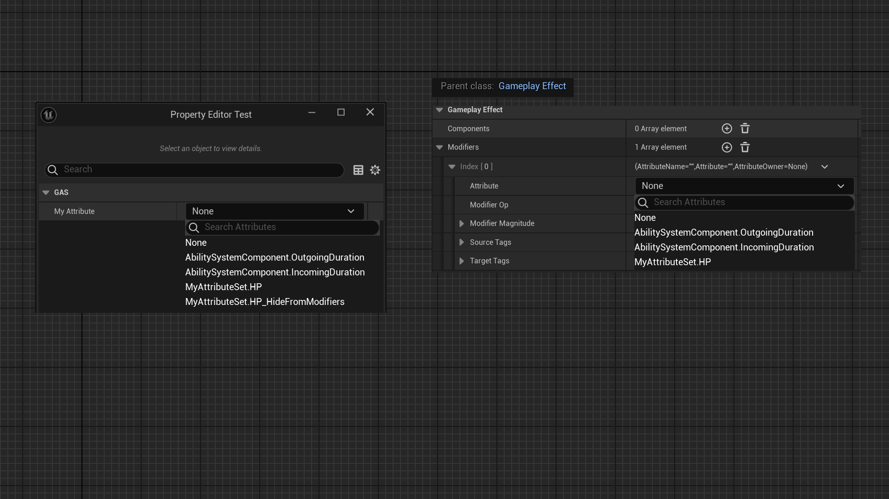

# HideFromModifiers

- **功能描述：** 指定AttributeSet下的某属性不出现在GameplayEffect下的Modifiers的Attribute选择里。
- **使用位置：** UPROPERTY
- **引擎模块：** GAS
- **元数据类型：** bool
- **限制类型：** UAttributeSet下的属性
- **关联项：** [HideInDetailsView](../HideInDetailsView/HideInDetailsView.md)
- **常用程度：** ★★★

指定AttributeSet下的某属性不出现在GameplayEffect下的Modifiers的Attribute选择里。

## 测试代码：

```cpp
UCLASS()
class UMyAttributeSet : public UAttributeSet
{
	GENERATED_BODY()
public:
	UPROPERTY(EditAnywhere, BlueprintReadWrite, Category = "Core")
	float HP = 100.f;

	UPROPERTY(EditAnywhere, BlueprintReadWrite, Category = "Core", meta = (HideInDetailsView))
	float HP_HideInDetailsView = 100.f;

	UPROPERTY(EditAnywhere, BlueprintReadWrite, Category = "Core", meta = (HideFromModifiers))
	float HP_HideFromModifiers = 100.f;
};
UCLASS()
class UMyAttributeSetTest : public UObject
{
	GENERATED_BODY()
public:
	UPROPERTY(BlueprintReadWrite, EditAnywhere, Category = "GAS")
	FGameplayAttribute MyAttribute;
};
```

## 测试结果：

在蓝图中创建一个GameplayEffect，然后观察其Modifiers下的Attribute选择。

发现HP_HideFromModifiers 可以出现在正常的FGameplayAttribute 选项卡中，但不能出现在Modifiers下的Attribute选项卡里。这就是这里的作用。



## 原理：

在FGameplayModifierInfo的Attribute属性上有FilterMetaTag的元数据，然后取出其里面的值，最终还是传到GetAllAttributeProperties作为FilterMetaStr来过滤。因此属性上出现HideFromModifiers就不能出现。

```cpp
USTRUCT(BlueprintType)
struct GAMEPLAYABILITIES_API FGameplayModifierInfo
{
	GENERATED_USTRUCT_BODY()
	
	/** The Attribute we modify or the GE we modify modifies. */
	UPROPERTY(EditDefaultsOnly, Category=GameplayModifier, meta=(FilterMetaTag="HideFromModifiers"))
	FGameplayAttribute Attribute;
};

void FAttributePropertyDetails::CustomizeHeader( TSharedRef<IPropertyHandle> StructPropertyHandle, class FDetailWidgetRow& HeaderRow, IPropertyTypeCustomizationUtils& StructCustomizationUtils )
{
		const FString& FilterMetaStr = StructPropertyHandle->GetProperty()->GetMetaData(TEXT("FilterMetaTag"));
	SNew(SGameplayAttributeWidget)
	.OnAttributeChanged(this, &FAttributePropertyDetails::OnAttributeChanged)
	.DefaultProperty(PropertyValue)
	.FilterMetaData(FilterMetaStr)
}
void FGameplayAttribute::GetAllAttributeProperties(TArray<FProperty*>& OutProperties, FString FilterMetaStr, bool UseEditorOnlyData)
{}
```
