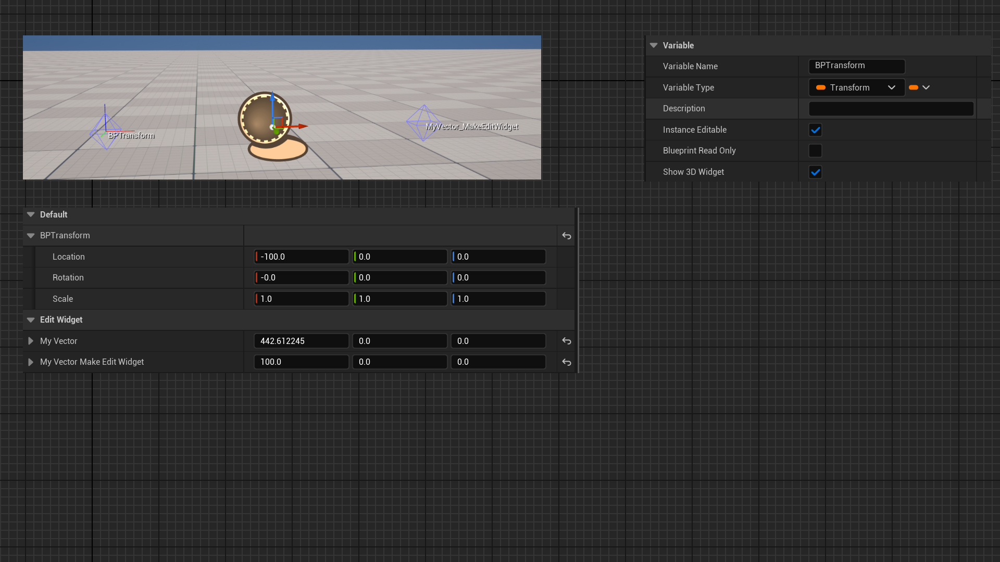

# MakeEditWidget

Description: 使FVector和FTranform在场景编辑器里出现一个可移动的控件。
Usage: UPROPERTY
Feature: Editor
Group: Scene
Type: bool
LimitedType: FVector，FTranform
Status: Done
Sub-item: ValidateWidgetUsing (ValidateWidgetUsing.md)

使FVector和FTranform在场景编辑器里出现一个可移动的控件。

这样相比直接的数值编辑更加的直观一些。

测试代码：

```cpp
UCLASS(BlueprintType)
class INSIDER_API AMyActor_EditWidget :public AActor
{
	GENERATED_BODY()
public:
	UPROPERTY(EditAnywhere,BlueprintReadWrite,Category="EditWidget")
	FVector MyVector;

	UPROPERTY(EditAnywhere,BlueprintReadWrite,Category="EditWidget",meta=(MakeEditWidget))
	FVector MyVector_MakeEditWidget;
};

```

测试结果：

在蓝图里继承的AMyActor_EditWidget 子类里加上另外一个FTransform变量，可以看见“Show 3D Widget”的选项，这个和MyVector_MakeEditWidget都在场景里出现了可移动的控件。



原理：

判断如果是FVector或FTransform，并且有MakeEditWidget属性，则可以创建控件。

```cpp
/** Value of UPROPERTY can be edited with a widget in the editor (translation, rotation) */
static UNREALED_API const FName MD_MakeEditWidget;
/** Specifies a function used for validation of the current value of a property.  The function returns a string that is empty if the value is valid, or contains an error description if the value is invalid */
static UNREALED_API const FName MD_ValidateWidgetUsing;

bool FLegacyEdModeWidgetHelper::CanCreateWidgetForStructure(const UStruct* InPropStruct)
{
	return InPropStruct && (InPropStruct->GetFName() == NAME_Vector || InPropStruct->GetFName() == NAME_Transform);
}

bool FLegacyEdModeWidgetHelper::ShouldCreateWidgetForProperty(FProperty* InProp)
{
	return CanCreateWidgetForProperty(InProp) && InProp->HasMetaData(MD_MakeEditWidget);
}

```