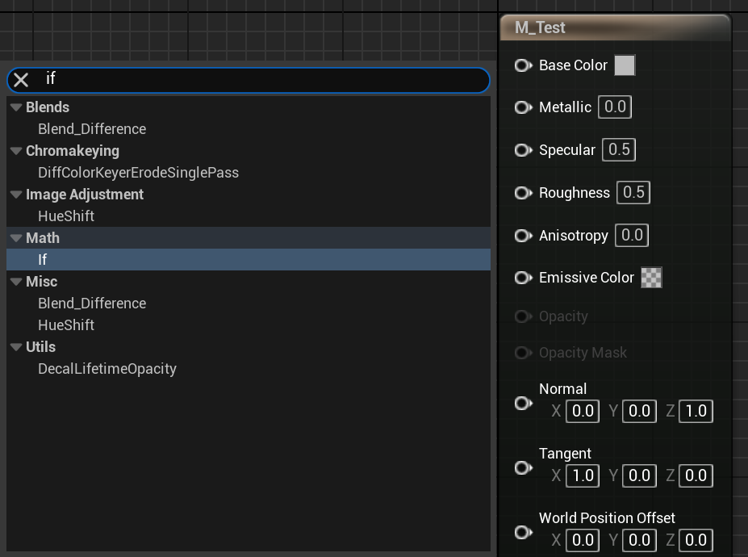

# MaterialControlFlow

- **功能描述：** 标识该UMaterialExpression为一个控制流节点，当前在材质蓝图右键菜单中隐藏。
- **使用位置：** UCLASS
- **引擎模块：** Material
- **元数据类型：** bool
- **限制类型：** UMaterialExpression子类
- **常用程度：** ★

标识该UMaterialExpression为一个控制流节点，当前在材质蓝图右键菜单中隐藏。

一般是在IfThenElse，ForLoop这种节点上，当前引擎实现还未完善，因此该功能禁用。

## 源码例子：

```cpp
UCLASS(collapsecategories, hidecategories=Object, MinimalAPI)
class UMaterialExpressionIf : public UMaterialExpression
{}

UCLASS(collapsecategories, hidecategories = Object, MinimalAPI, meta=(MaterialControlFlow))
class UMaterialExpressionIfThenElse : public UMaterialExpression
{}
```

## 测试效果：

可以找到If节点，但是无法调用IfThenElse节点。



## 原理：

在遍历所有可用FMaterialExpression的时候，如果有MaterialControlFlow则略过。当前引擎下AllowMaterialControlFlow一直未false，未实现。

```cpp

// r.MaterialEnableControlFlow is removed and the feature is forced disabled as how control flow should be
// implemented in the material editor is still under discussion.
inline bool AllowMaterialControlFlow()
{
	return false;
}

void MaterialExpressionClasses::InitMaterialExpressionClasses()
{
		static const auto CVarMaterialEnableNewHLSLGenerator = IConsoleManager::Get().FindTConsoleVariableDataInt(TEXT("r.MaterialEnableNewHLSLGenerator"));
		const bool bEnableControlFlow = AllowMaterialControlFlow();
		const bool bEnableNewHLSLGenerator = CVarMaterialEnableNewHLSLGenerator->GetValueOnAnyThread() != 0;
	
		for( TObjectIterator<UClass> It ; It ; ++It )
		{
			if( Class->IsChildOf(UMaterialExpression::StaticClass()) )
			{
					// Hide node types related to control flow, unless it's enabled
					if (!bEnableControlFlow && Class->HasMetaData("MaterialControlFlow"))
					{
									continue;
					}
					
					if (!bEnableNewHLSLGenerator && Class->HasMetaData("MaterialNewHLSLGenerator"))
					{
									continue;
					}
					
					// Hide node types that are tagged private
					if(Class->HasMetaData(TEXT("Private")))
					{
									continue;
					}
				AllExpressionClasses.Add(MaterialExpression);
			}
		}
}
```
