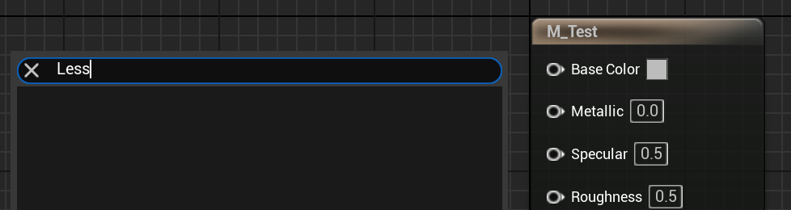

# MaterialNewHLSLGenerator

- **功能描述：** 标识该UMaterialExpression为采用新HLSL生成器的节点，当前在材质蓝图右键菜单中隐藏。
- **使用位置：** UCLASS
- **引擎模块：** Material
- **元数据类型：** bool
- **限制类型：** UMaterialExpression子类
- **常用程度：** ★

标识该UMaterialExpression为采用新HLSL生成器的节点，当前在材质蓝图右键菜单中隐藏。

## 源码例子：

```cpp

UCLASS(MinimalAPI, meta = (MaterialNewHLSLGenerator))
class UMaterialExpressionLess : public UMaterialExpressionBinaryOp
{
	GENERATED_UCLASS_BODY()
#if WITH_EDITOR
	virtual UE::HLSLTree::EOperation GetBinaryOp() const override { return UE::HLSLTree::EOperation::Less; }
#endif // WITH_EDITOR
};
```

## 测试效果：

材质蓝图里无法调用Less。



## 原理：

在遍历所有可用FMaterialExpression的时候，如果有MaterialNewHLSLGenerator则略过。当前引擎下r.MaterialEnableNewHLSLGenerator是只读的，且实现未完全。

```cpp
static TAutoConsoleVariable<int32> CVarMaterialEnableNewHLSLGenerator(
	TEXT("r.MaterialEnableNewHLSLGenerator"),
	0,
	TEXT("Enables the new (WIP) material HLSL generator.\n")
	TEXT("0 - Don't allow\n")
	TEXT("1 - Allow if enabled by material\n")
	TEXT("2 - Force all materials to use new generator\n"),
	ECVF_RenderThreadSafe | ECVF_ReadOnly);

void MaterialExpressionClasses::InitMaterialExpressionClasses()
{
		static const auto CVarMaterialEnableNewHLSLGenerator = IConsoleManager::Get().FindTConsoleVariableDataInt(TEXT("r.MaterialEnableNewHLSLGenerator"));
		const bool bEnableControlFlow = AllowMaterialControlFlow();
		const bool bEnableNewHLSLGenerator = CVarMaterialEnableNewHLSLGenerator->GetValueOnAnyThread() != 0;
	
		for( TObjectIterator<UClass> It ; It ; ++It )
		{
			if( Class->IsChildOf(UMaterialExpression::StaticClass()) )
			{
					// Hide node types related to control flow, unless it's enabled
					if (!bEnableControlFlow && Class->HasMetaData("MaterialControlFlow"))
					{
									continue;
					}
					
					if (!bEnableNewHLSLGenerator && Class->HasMetaData("MaterialNewHLSLGenerator"))
					{
									continue;
					}
					
					// Hide node types that are tagged private
					if(Class->HasMetaData(TEXT("Private")))
					{
									continue;
					}
				AllExpressionClasses.Add(MaterialExpression);
			}
		}
}
```
