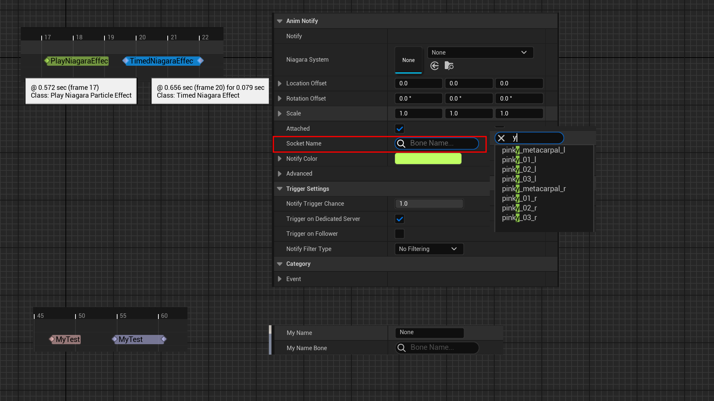

# AnimNotifyBoneName

Usage: UPROPERTY
Feature: Behavior
Type: bool
Description: 使得UAnimNotify或UAnimNotifyState下的FName属性作为BoneName的作用。
Example: meta=(AnimNotifyBoneName="true")
LimitedType: UAnimNotify或UAnimNotifyState子类下的FName属性
Status: Done
Group: AnimationGraph

使得UAnimNotify或UAnimNotifyState下的FName属性作为BoneName的作用。

在动画通知的时候，也常常需要一个传递骨骼名字参数，用普通的字符串参数显然不够定制化。因此给一个FName属性标上AnimNotifyBoneName就可以在配合的细节面板定制化里为它创建专门的更便于填写BoneName的UI。

源码中例子：

```cpp
UCLASS(const, hidecategories = Object, collapsecategories, meta = (DisplayName = "Play Niagara Particle Effect"), MinimalAPI)
class UAnimNotify_PlayNiagaraEffect : public UAnimNotify
{
		// SocketName to attach to
	UPROPERTY(EditAnywhere, BlueprintReadWrite, Category = "AnimNotify", meta = (AnimNotifyBoneName = "true"))
	FName SocketName;
}

UCLASS(Blueprintable, meta = (DisplayName = "Timed Niagara Effect"), MinimalAPI)
class UAnimNotifyState_TimedNiagaraEffect : public UAnimNotifyState
{
	// The socket within our mesh component to attach to when we spawn the Niagara component
	UPROPERTY(EditAnywhere, BlueprintReadWrite, Category = NiagaraSystem, meta = (ToolTip = "The socket or bone to attach the system to", AnimNotifyBoneName = "true"))
	FName SocketName;
}
```

测试代码：

```cpp
UCLASS(BlueprintType)
class INSIDER_API UAnimNotify_MyTest:public UAnimNotify
{
	GENERATED_BODY()
public:
	UPROPERTY(EditAnywhere, BlueprintReadWrite)
	FName MyName;

	UPROPERTY(EditAnywhere, BlueprintReadWrite,meta=(AnimNotifyBoneName="true"))
	FName MyName_Bone;
};

UCLASS(BlueprintType)
class INSIDER_API UAnimNotifyState_MyTest:public UAnimNotifyState
{
	GENERATED_BODY()
public:
	UPROPERTY(EditAnywhere, BlueprintReadWrite)
	FName MyName;

	UPROPERTY(EditAnywhere, BlueprintReadWrite,meta=(AnimNotifyBoneName="true"))
	FName MyName_Bone;
};
```

测试效果：

在一个动画序列里加上动画通知，可以加两种：UAnimNotify或UAnimNotifyState。首先引擎里的自带例子UAnimNotify_PlayNiagaraEffect 和UAnimNotifyState_TimedNiagaraEffect ，可以看见在右侧的细节面板上的SocketName的UI不是普通的字符串。

我们自己定义的MyBoneName的动画通知，也可以达成同样的效果。MyName_Bone因为加了AnimNotifyBoneName，就和普通的MyName不一样了。



原理：

在定制化的时候，根据AnimNotify下的属性是否有这个标记，生成专门的的UI。

```cpp
bool FAnimNotifyDetails::CustomizeProperty(IDetailCategoryBuilder& CategoryBuilder, UObject* Notify, TSharedPtr<IPropertyHandle> Property)
{
	else if (InPropertyHandle->GetBoolMetaData(TEXT("AnimNotifyBoneName")))
	{
		// Convert this property to a bone name property
		AddBoneNameProperty(CategoryBuilder, Notify, InPropertyHandle);
	}
	
	 if (bIsBoneName)
		{
			AddBoneNameProperty(CategoryBuilder, Notify, Property);
			return true;
		}
}
```