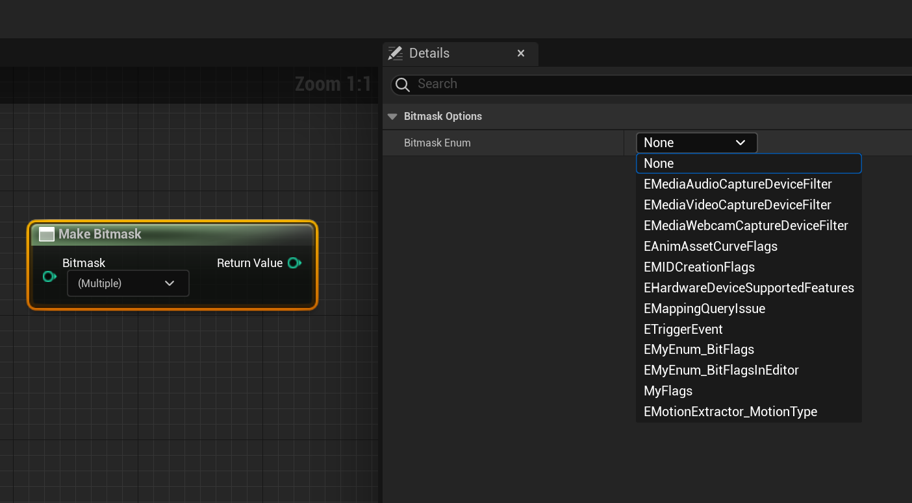

# Bitflags

Usage: UENUM
Feature: Blueprint
Type: bool
Description: 设定一个枚举支持采用位标记赋值
Example: UENUM(Meta = (Bitflags))
enum class EColorBits
{
ECB_Red,
ECB_Green,
ECB_Blue
};
UPROPERTY(EditAnywhere, Meta = (Bitmask, BitmaskEnum = "EColorBits"))
int32 ColorFlags;
Status: Done
Group: Enum Property
Sub-item: UseEnumValuesAsMaskValuesInEditor (UseEnumValuesAsMaskValuesInEditor.md)

注意这个和UENUM(flags)的区别，后者是影响C++里字符串输出函数。

这个是指定该枚举支持位标记，从而在蓝图中可以被选择出来。

```cpp
UENUM(BlueprintType,Flags)
enum class EMyEnum_Flags:uint8
{
	First,
	Second,
	Third,
};
UENUM(BlueprintType,Meta = (Bitflags))
enum class EMyEnum_BitFlags:uint8
{
	First,
	Second,
	Third,
};
```

如EMyEnum_Flags就不会被列在选项里。而EMyEnum_BitFlags就可以被列进来。



如果没有UPROPERTY的配合使用，则蓝图里只能单项选择

