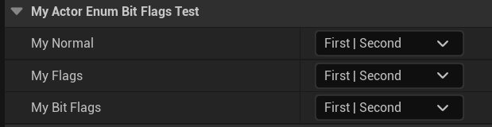

# Bitmask

Usage: UPROPERTY
Feature: Blueprint
Type: bool
Description: 设定一个属性采用Bitmask赋值
Example: UPROPERTY(EditAnywhere, Meta = (Bitmask))
int32 BasicBits;
会自动按位标记生成名字("Flag 1", "Flag 2", "Flag 3", etc.)
LimitedType: 用来表示枚举值的int32
Status: Done
Group: Enum Property
Sub-item: BitmaskEnum (BitmaskEnum.md)

这个标记和enum身上的定义并没有一定的关系，因此可以单独定义。

```cpp
UENUM(BlueprintType)
enum class EMyEnum_Normal:uint8
{
	First,
	Second,
	Third,
};

UENUM(BlueprintType,Flags)
enum class EMyEnum_Flags:uint8
{
	First,
	Second,
	Third,
};

UENUM(BlueprintType,Meta = (Bitflags))
enum class EMyEnum_BitFlags:uint8
{
	First,
	Second,
	Third,
};

UCLASS(Blueprintable, BlueprintType)
class INSIDER_API AMyActor_EnumBitFlags_Test:public AActor
{
	GENERATED_BODY()
public:
	UPROPERTY(EditAnywhere, Meta = (Bitmask, BitmaskEnum = "EMyEnum_Normal"))
	int32 MyNormal;

	UPROPERTY(EditAnywhere, Meta = (Bitmask, BitmaskEnum = "EMyEnum_Flags"))
	int32 MyFlags;

	UPROPERTY(EditAnywhere, Meta = (Bitmask, BitmaskEnum = "EMyEnum_BitFlags"))
	int32 MyBitFlags;
};
```

都是可以在蓝图中用标记来定义



可以用BitmaskEnum进一步提供枚举值