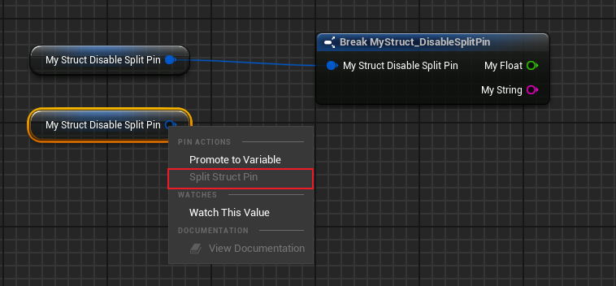

# DisableSplitPin

Usage: USTRUCT
Feature: Blueprint
Type: bool
Description: 禁用Struct的split功能
Status: Done
Group: PIn

对于某些Struct，特别是只有一个成员变量的结构，有时候如果按照默认的展开则会显得很怪。这个时候就希望能够禁用掉这个功能。但是注意依然可以手动在蓝图里Break来访问成员变量。如果在蓝图里也不想暴露成员变量访问，那应该在UPROPERTY上不能加BlueprintReadWrite/BlueprintReadOnly

在源码里搜索，如FGameplayTag，FPostProcessSettings，FSlatePostSettings

测试代码：

```cpp
USTRUCT(BlueprintType, meta = (DisableSplitPin))
struct INSIDER_API FMyStruct_DisableSplitPin
{
	GENERATED_BODY()

	UPROPERTY(BlueprintReadWrite, EditAnywhere)
	float MyFloat;
	UPROPERTY(BlueprintReadWrite, EditAnywhere)
	FString MyString;
};

USTRUCT(BlueprintType)
struct INSIDER_API FMyStruct_WithSplitPin
{
	GENERATED_BODY()

	UPROPERTY(BlueprintReadWrite, EditAnywhere)
	float MyFloat;
	UPROPERTY(BlueprintReadWrite, EditAnywhere)
	FString MyString;
};
```



允许的对比

