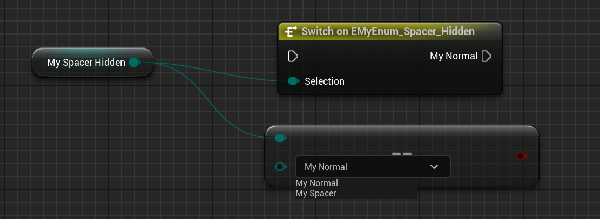

# Hidden

Usage: UENUM
Feature: Blueprint
Type: bool
Description: 隐藏UENUM的某个值
LimitedType: UENUM的值
Status: Done
Group: Enum Property

隐藏UENUM的某个值。

测试代码：

```cpp

UENUM(Blueprintable,BlueprintType)
enum class EMyEnum_Spacer_Hidden :uint8
{
	MyNormal,
	MySpacer UMETA(Spacer),
	MyHidden UMETA(Hidden),
};

UCLASS(BlueprintType)
class INSIDER_API UMyEnum_Test :public UObject
{
	GENERATED_BODY()
public:
	UPROPERTY(EditAnywhere,BlueprintReadWrite)
	EMyEnum_Spacer_Hidden MyEnum_Spacer_Hidden;
};
```

测试效果：


但是蓝图里访问：



## 原理：

在属性细节面板里生成枚举可能的值的时候，会判断Hidden和Spacer选项来隐藏。

但是在SEnumComboBox和SGraphPinEnum这种在蓝图里显示的时候，只会判断Hidden，而没有（忘了？）判断Spacer，因此MySpacer是依然会被显示出来。

```cpp
bool FPropertyHandleBase::GeneratePossibleValues(TArray<FString>& OutOptionStrings, TArray< FText >& OutToolTips, TArray<bool>& OutRestrictedItems, TArray<FText>* OutDisplayNames)
{
		// Ignore hidden enums
	bool bShouldBeHidden = Enum->HasMetaData(TEXT("Hidden"), EnumIndex ) || Enum->HasMetaData(TEXT("Spacer"), EnumIndex );
	if (!bShouldBeHidden)
	{
		if(ValidEnumValues.Num() > 0)
		{
			bShouldBeHidden = !ValidEnumValues.Contains(Enum->GetNameByIndex(EnumIndex));
		}
		// If both are specified, InvalidEnumValues takes precedence
		else if(InvalidEnumValues.Num() > 0)
		{
			bShouldBeHidden = InvalidEnumValues.Contains(Enum->GetNameByIndex(EnumIndex));
		}
	}
}

void SEnumComboBox::Construct(const FArguments& InArgs, const UEnum* InEnum)
{
		if (Enum->HasMetaData(TEXT("Hidden"), Index) == false)
		{
			VisibleEnums.Emplace(Index, Enum->GetValueByIndex(Index), Enum->GetDisplayNameTextByIndex(Index), Enum->GetToolTipTextByIndex(Index));
		}
}

void SGraphPinEnum::GenerateComboBoxIndexes( TArray< TSharedPtr<int32> >& OutComboBoxIndexes )
{
	// Ignore hidden enum values
	if( !EnumPtr->HasMetaData(TEXT("Hidden"), EnumIndex ) )
	{
		TSharedPtr<int32> EnumIdxPtr(new int32(EnumIndex));
		OutComboBoxIndexes.Add(EnumIdxPtr);
	}
}
```