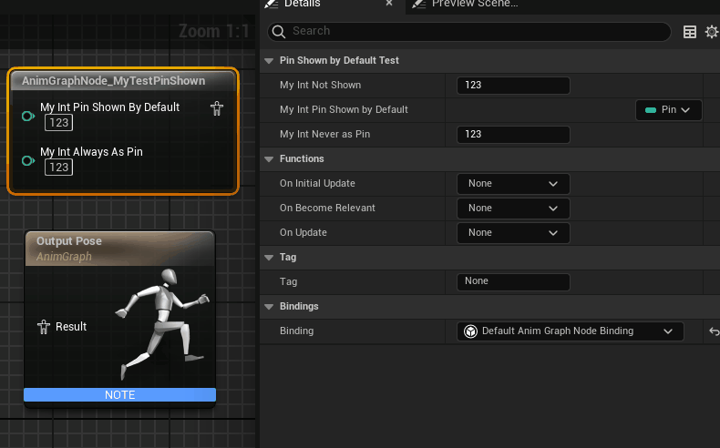

# PinShownByDefault

Usage: UPROPERTY
Feature: Blueprint
Type: bool
Description: 在动画蓝图中使得动画节点的某个属性一开始就暴露出来成为引脚，但也可以改变。
LimitedType: FAnimNode_Base
Status: Done
Group: AnimationGraph
Sub-item: AlwaysAsPin (AlwaysAsPin.md), NeverAsPin (NeverAsPin.md)

在动画蓝图中使得动画节点的某个属性一开始就暴露出来成为引脚。

和常规的蓝图不同，FAnimNode_Base里面的属性默认是不在节点上显示出来的。因此才需要这个meta显式的指定哪些需要显式。

PinShownByDefault目前只在动画蓝图节点上应用。

相反的，可以用PinHiddenByDefault来隐藏属性成为引脚。

测试代码：

```cpp
USTRUCT(BlueprintInternalUseOnly)
struct INSIDEREDITOR_API FAnimNode_MyTestPinShown : public FAnimNode_Base
{
	GENERATED_USTRUCT_BODY()

	UPROPERTY(EditAnywhere, BlueprintReadWrite, Category = PinShownByDefaultTest)
	int32 MyInt_NotShown = 123;

	UPROPERTY(EditAnywhere, BlueprintReadWrite, Category = PinShownByDefaultTest, meta = (PinShownByDefault))
	int32 MyInt_PinShownByDefault = 123;

	UPROPERTY(EditAnywhere, BlueprintReadWrite, Category = PinShownByDefaultTest, meta = (AlwaysAsPin))
	int32 MyInt_AlwaysAsPin = 123;

	UPROPERTY(EditAnywhere, BlueprintReadWrite, Category = PinShownByDefaultTest, meta = (NeverAsPin))
	int32 MyInt_NeverAsPin = 123;
};

UCLASS()
class INSIDEREDITOR_API UAnimGraphNode_MyTestPinShown : public UAnimGraphNode_Base
{
	GENERATED_UCLASS_BODY()

	UPROPERTY(EditAnywhere, Category = Settings)
	FAnimNode_MyTestPinShown Node;
};
```

测试效果：

可见，同样的两个属性，MyInt_NotShown 默认情况不显示成节点，只能在细节面板里编辑。而MyInt_PinShownByDefault默认情况下成为引脚。当PinShownByDefault还可以改变去掉Pin的功能。



原理：

源码里唯一用的地方就是在FAnimBlueprintNodeOptionalPinManager，其实就是处理动画蓝图节点的Pin如何显示。

```cpp
void FAnimBlueprintNodeOptionalPinManager::GetRecordDefaults(FProperty* TestProperty, FOptionalPinFromProperty& Record) const
{
	const UAnimationGraphSchema* Schema = GetDefault<UAnimationGraphSchema>();

	// Determine if this is a pose or array of poses
	FArrayProperty* ArrayProp = CastField<FArrayProperty>(TestProperty);
	FStructProperty* StructProp = CastField<FStructProperty>(ArrayProp ? ArrayProp->Inner : TestProperty);
	const bool bIsPoseInput = (StructProp  && StructProp->Struct->IsChildOf(FPoseLinkBase::StaticStruct()));

	//@TODO: Error if they specified two or more of these flags
	const bool bAlwaysShow = TestProperty->HasMetaData(Schema->NAME_AlwaysAsPin) || bIsPoseInput;
	const bool bOptional_ShowByDefault = TestProperty->HasMetaData(Schema->NAME_PinShownByDefault);
	const bool bOptional_HideByDefault = TestProperty->HasMetaData(Schema->NAME_PinHiddenByDefault);
	const bool bNeverShow = TestProperty->HasMetaData(Schema->NAME_NeverAsPin);
	const bool bPropertyIsCustomized = TestProperty->HasMetaData(Schema->NAME_CustomizeProperty);
	const bool bCanTreatPropertyAsOptional = CanTreatPropertyAsOptional(TestProperty);

	Record.bCanToggleVisibility = bCanTreatPropertyAsOptional && (bOptional_ShowByDefault || bOptional_HideByDefault);
	Record.bShowPin = bAlwaysShow || bOptional_ShowByDefault;
	Record.bPropertyIsCustomized = bPropertyIsCustomized;
}
```