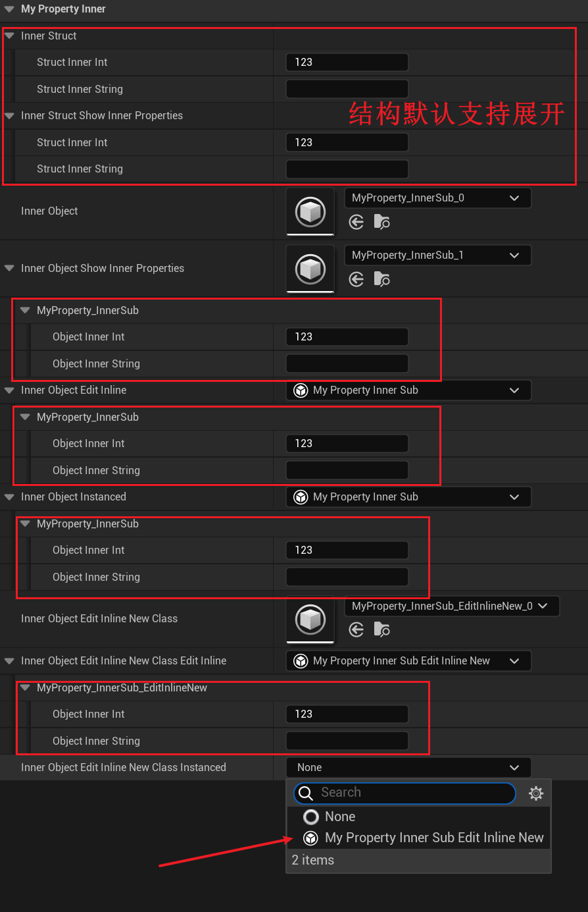

# ShowInnerProperties

Description: 在属性细节面板中显示对象引用的内部属性
Usage: UPROPERTY
Feature: Editor
Group: Object Property
Type: bool
LimitedType: UObject*
Status: Done
Sub-item: ShowOnlyInnerProperties (ShowOnlyInnerProperties.md), FullyExpand (FullyExpand.md), CollapsableChildProperties (CollapsableChildProperties.md)

在属性细节面板中显示对象引用的内部属性。

默认情况下，对象引用属性的内部属性在细节面板里是不会显示出来的，只是孤零零的显示一个对象名字。但你如果想直接显示出其内部属性然后可以编辑的话，就需要ShowInnerProperties这个meta的作用。

但ShowInnerProperties作用有两个限定条件，一是这个属性得是UObject*，二是这个属性不是个容器。

同时也注意到，Struct属性是默认就会显示内部属性的，因此也不需要再设置ShowInnerProperties。

**和EditInineNew的区别是什么？**

这种效果，和在UCLASS上设置EditInineNew配合其对象引用属性上设置Instanced，达成的效果很相似。区别是UCLASS上设置EditInineNew会使得一个类的对象属性引用可以在属性面板里创建对象， 而UPROPERTY上的Instanced，会使得这个属性自动的增加EditInline的meta，因此也会产生显示内部属性的同样效果。因此结论上来说，和ShowInnerProperties像的是本质是EditInline这个meta。但EditInline的效果多了一层是它支持对象容器，而ShowInnerProperties只支持单个对象引用属性。

测试代码：

```cpp

USTRUCT(BlueprintType)
struct FMyPropertyInner
{
	GENERATED_BODY()
public:
	UPROPERTY(EditAnywhere, BlueprintReadWrite)
	int32 StructInnerInt = 123;
	UPROPERTY(EditAnywhere, BlueprintReadWrite)
	FString StructInnerString;
};

UCLASS(BlueprintType)
class INSIDER_API UMyProperty_InnerSub :public UObject
{
	GENERATED_BODY()
public:
	UPROPERTY(EditAnywhere, BlueprintReadWrite)
	int32 ObjectInnerInt = 123;
	UPROPERTY(EditAnywhere, BlueprintReadWrite)
	FString ObjectInnerString;
};

UCLASS(BlueprintType, EditInlineNew)
class INSIDER_API UMyProperty_InnerSub_EditInlineNew :public UObject
{
	GENERATED_BODY()
public:
	UPROPERTY(EditAnywhere, BlueprintReadWrite)
	int32 ObjectInnerInt = 123;
	UPROPERTY(EditAnywhere, BlueprintReadWrite)
	FString ObjectInnerString;
};

UCLASS(Blueprintable, BlueprintType)
class INSIDER_API UMyProperty_Inner :public UDataAsset
{
	GENERATED_BODY()
public:
	UPROPERTY(EditAnywhere, BlueprintReadWrite)
	FMyPropertyInner InnerStruct;
	UPROPERTY(EditAnywhere, BlueprintReadWrite, meta = (ShowInnerProperties))
	FMyPropertyInner InnerStruct_ShowInnerProperties;
	
	UPROPERTY(EditAnywhere, BlueprintReadWrite)
	UMyProperty_InnerSub* InnerObject;
	UPROPERTY(EditAnywhere, BlueprintReadWrite, meta = (ShowInnerProperties))
	UMyProperty_InnerSub* InnerObject_ShowInnerProperties;
	
	//(Category = MyProperty_Inner, EditInline = , ModuleRelativePath = Property/MyProperty_Inner.h)
	//CPF_Edit | CPF_BlueprintVisible | CPF_ZeroConstructor | CPF_NoDestructor | CPF_HasGetValueTypeHash | CPF_NativeAccessSpecifierPublic 
	UPROPERTY(EditAnywhere, BlueprintReadWrite, meta = (EditInline))
	UMyProperty_InnerSub* InnerObject_EditInline;
	
	//(Category = MyProperty_Inner, EditInline = true, ModuleRelativePath = Property/MyProperty_Inner.h)
	//CPF_Edit | CPF_BlueprintVisible | CPF_ExportObject | CPF_ZeroConstructor | CPF_InstancedReference | CPF_NoDestructor | CPF_PersistentInstance | CPF_HasGetValueTypeHash | CPF_NativeAccessSpecifierPublic 
	UPROPERTY(EditAnywhere, BlueprintReadWrite, Instanced)
	UMyProperty_InnerSub* InnerObject_Instanced;
	
	UPROPERTY(EditAnywhere, BlueprintReadWrite)
	UMyProperty_InnerSub_EditInlineNew* InnerObject_EditInlineNewClass;
	UPROPERTY(EditAnywhere, BlueprintReadWrite, meta = (EditInline))
	UMyProperty_InnerSub_EditInlineNew* InnerObject_EditInlineNewClass_EditInline;
	UPROPERTY(EditAnywhere, BlueprintReadWrite, Instanced)
	UMyProperty_InnerSub_EditInlineNew* InnerObject_EditInlineNewClass_Instanced;

public:
	UFUNCTION(CallInEditor)
	void ClearInnerObject();
	UFUNCTION(CallInEditor)
	void InitInnerObject();
};

void UMyProperty_Inner::ClearInnerObject()
{
	InnerObject = nullptr;
	InnerObject_ShowInnerProperties = nullptr;
	InnerObject_EditInline = nullptr;
	InnerObject_Instanced = nullptr;

	InnerObject_EditInlineNewClass = nullptr;
	InnerObject_EditInlineNewClass_EditInline = nullptr;
	InnerObject_EditInlineNewClass_Instanced = nullptr;

	Modify();

	FPropertyEditorModule& PropertyEditorModule = FModuleManager::GetModuleChecked<FPropertyEditorModule>("PropertyEditor");
	PropertyEditorModule.NotifyCustomizationModuleChanged();
}

void UMyProperty_Inner::InitInnerObject()
{
	InnerObject = NewObject<UMyProperty_InnerSub>(this);
	InnerObject_ShowInnerProperties = NewObject<UMyProperty_InnerSub>(this);
	InnerObject_EditInline = NewObject<UMyProperty_InnerSub>(this);
	InnerObject_Instanced = NewObject<UMyProperty_InnerSub>(this);

	InnerObject_EditInlineNewClass = NewObject<UMyProperty_InnerSub_EditInlineNew>(this);
	InnerObject_EditInlineNewClass_EditInline = NewObject<UMyProperty_InnerSub_EditInlineNew>(this);
	//InnerObject_EditInlineNewClass_Instanced = NewObject<UMyProperty_InnerSub_EditInlineNew>(this);

	Modify();

	FPropertyEditorModule& PropertyEditorModule = FModuleManager::GetModuleChecked<FPropertyEditorModule>("PropertyEditor");
	PropertyEditorModule.NotifyCustomizationModuleChanged();
}
```

蓝图效果：



可以观察到：

- 结构的属性默认支持展开内部属性
- 带有ShowInnerProperties的UMyProperty_InnerSub* InnerObject_ShowInnerProperties;支持展开属性
- 带有EditInline和Instanced的UMyProperty_InnerSub* 也都支持展开内部属性，也可以观察到他们的meta是一致的，都带有EditInline=true
- 只有EditInlineNew的UCLASS的UMyProperty_InnerSub_EditInlineNew* InnerObject_EditInlineNewClass;其对象引用不支持展开属性，说明在类上设置EditInlineNew并没有作用。
- 但是我们也观察到InnerObject_EditInlineNewClass_Instanced的设置里支持直接创建对象，因为其类上有EditInlineNew。而InnerObject_Instanced上并不支持直接创建对象，因为其类UMyProperty_InnerSub上并没有EditInlineNew，因此不会出现在可选框里。

## 扩展例子：

在源码中搜索观察到UChildActorComponent::ChildActorTemplate上也会带有ShowInnerProperties，则就是一个典型的应用，以便让我们直接在熟悉细节面板里直接编辑ChildActor的属性数据。

但假如我们去掉这个ShowInnerProperties，我们可以来前后对比一下效果：

```cpp
class UChildActorComponent : public USceneComponent
{
	UPROPERTY(VisibleDefaultsOnly, DuplicateTransient, Category=ChildActorComponent, meta=(ShowInnerProperties))
	TObjectPtr<AActor> ChildActorTemplate;
}

void UMyProperty_Inner::RemoveActorMeta()
{
	FProperty* prop = UChildActorComponent::StaticClass()->FindPropertyByName(TEXT("ChildActorTemplate"));
	prop->RemoveMetaData(TEXT("ShowInnerProperties"));
}

void UMyProperty_Inner::AddActorMeta()
{
	FProperty* prop = UChildActorComponent::StaticClass()->FindPropertyByName(TEXT("ChildActorTemplate"));
	prop->SetMetaData(TEXT("ShowInnerProperties"), TEXT(""));
}

```

## 对比效果：


可以发现，去除ShowInnerProperties后，ChildActorTemplate属性退化成一个普通的对象引用，我们无法在上面直接编辑对象的内部属性。

## 原理：

源码里最典型的例子是ChildActorTemplate，这样就可以直接显示出内部的属性。

```cpp
class UChildActorComponent : public USceneComponent
{
	UPROPERTY(VisibleDefaultsOnly, DuplicateTransient, Category=ChildActorComponent, meta=(ShowInnerProperties))
	TObjectPtr<AActor> ChildActorTemplate;
}
```

作用的源码：

```cpp
void FPropertyNode::InitNode(const FPropertyNodeInitParams& InitParams)
{
		const bool bIsObjectOrInterface = CastField<FObjectPropertyBase>(MyProperty) || CastField<FInterfaceProperty>(MyProperty);
		// we are EditInlineNew if this property has the flag, or if inside a container that has the flag.
		bIsEditInlineNew = GotReadAddresses && bIsObjectOrInterface && !MyProperty->HasMetaData(Name_NoEditInline) && 
			(MyProperty->HasMetaData(Name_EditInline) || (bIsInsideContainer && OwnerProperty->HasMetaData(Name_EditInline)));
		bShowInnerObjectProperties = bIsObjectOrInterface && MyProperty->HasMetaData(Name_ShowInnerProperties);
		
		if (bIsEditInlineNew)
		{
			SetNodeFlags(EPropertyNodeFlags::EditInlineNew, true);
		}
		else if (bShowInnerObjectProperties)
		{
			SetNodeFlags(EPropertyNodeFlags::ShowInnerObjectProperties, true);
		}
}

void FItemPropertyNode::InitExpansionFlags(void)
{
	FProperty* MyProperty = GetProperty();

	if (TSharedPtr<FPropertyNode>& ValueNode = GetOrCreateOptionalValueNode())
	{
		// This is a set optional, so check its SetValue instead.
		MyProperty = ValueNode->GetProperty();
	}

	bool bExpandableType = CastField<FStructProperty>(MyProperty)
		|| (CastField<FArrayProperty>(MyProperty) || CastField<FSetProperty>(MyProperty) || CastField<FMapProperty>(MyProperty));

	if (bExpandableType
		|| HasNodeFlags(EPropertyNodeFlags::EditInlineNew)
		|| HasNodeFlags(EPropertyNodeFlags::ShowInnerObjectProperties)
		|| (MyProperty->ArrayDim > 1 && ArrayIndex == -1))
	{
		SetNodeFlags(EPropertyNodeFlags::CanBeExpanded, true);
	}
}
void FPropertyNode::RebuildChildren()
{
	if (HasNodeFlags(EPropertyNodeFlags::CanBeExpanded) && (ChildNodes.Num() == 0))
	{
		InitChildNodes();
		if (ExpandedPropertyItemSet.Size() > 0)
		{
			FPropertyNodeUtils::SetExpandedItems(ThisAsSharedRef, ExpandedPropertyItemSet);
		}
	}
}
```

特别注意，这里的bShowInnerObjectProperties的判断条件是bIsObjectOrInterface 且有meta，因此该特性只作用于对象引用上。然后如果判断有EPropertyNodeFlags::ShowInnerObjectProperties，则继续设置EPropertyNodeFlags::CanBeExpanded，最后导致展开对象的属性。