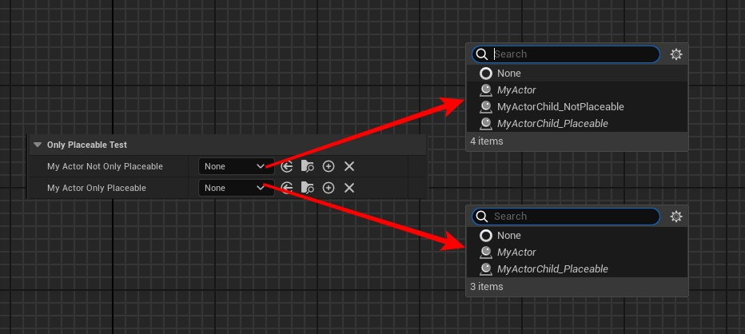

# OnlyPlaceable

- **功能描述：** 用在类属性上，指定是否只接受可被放置到场景里的Actor
- **使用位置：** UPROPERTY
- **引擎模块：** TypePicker
- **元数据类型：** bool
- **限制类型：** TSubClassOf, FSoftClassPath，UClass*
- **常用程度：** ★★

可以排除掉一些AInfo等不能放进场景里的Actor类。

## 测试代码：

```cpp

UCLASS(Blueprintable,BlueprintType)
class INSIDER_API AMyActor :public AActor
{
	GENERATED_BODY()
};

UCLASS(Blueprintable, BlueprintType)
class INSIDER_API AMyActorChild_Placeable :public AMyActor
{
	GENERATED_BODY()
};

UCLASS(Blueprintable, BlueprintType,NotPlaceable)
class INSIDER_API AMyActorChild_NotPlaceable :public AMyActor
{
	GENERATED_BODY()
};

public:
	UPROPERTY(EditAnywhere, BlueprintReadWrite, Category = "OnlyPlaceableTest")
	TSubclassOf<AMyActor> MyActor_NotOnlyPlaceable;

	UPROPERTY(EditAnywhere, BlueprintReadWrite, Category = "OnlyPlaceableTest", meta = (OnlyPlaceable))
	TSubclassOf<AMyActor> MyActor_OnlyPlaceable;
```

## 测试效果：

可见AMyActorChild_NotPlaceable 类因为加了NotPlaceable标记，就不能被MyActor_OnlyPlaceable属性选择上。



## 原理：

```cpp
bool FPropertyHandleBase::GeneratePossibleValues(TArray<FString>& OutOptionStrings, TArray< FText >& OutToolTips, TArray<bool>& OutRestrictedItems, TArray<FText>* OutDisplayNames)
{
	 if( Property->IsA(FClassProperty::StaticClass()) || Property->IsA(FSoftClassProperty::StaticClass()) )		
	{
		UClass* MetaClass = Property->IsA(FClassProperty::StaticClass()) 
			? CastFieldChecked<FClassProperty>(Property)->MetaClass
			: CastFieldChecked<FSoftClassProperty>(Property)->MetaClass;

		FString NoneStr( TEXT("None") );
		OutOptionStrings.Add( NoneStr );
		if (OutDisplayNames)
		{
			OutDisplayNames->Add(FText::FromString(NoneStr));
		}

		const bool bAllowAbstract = Property->GetOwnerProperty()->HasMetaData(TEXT("AllowAbstract"));
		const bool bBlueprintBaseOnly = Property->GetOwnerProperty()->HasMetaData(TEXT("BlueprintBaseOnly"));
		const bool bAllowOnlyPlaceable = Property->GetOwnerProperty()->HasMetaData(TEXT("OnlyPlaceable"));
		UClass* InterfaceThatMustBeImplemented = Property->GetOwnerProperty()->GetClassMetaData(TEXT("MustImplement"));

		if (!bAllowOnlyPlaceable || MetaClass->IsChildOf<AActor>())
		{
			for (TObjectIterator<UClass> It; It; ++It)
			{
				if (It->IsChildOf(MetaClass)
					&& PropertyEditorHelpers::IsEditInlineClassAllowed(*It, bAllowAbstract)
					&& (!bBlueprintBaseOnly || FKismetEditorUtilities::CanCreateBlueprintOfClass(*It))
					&& (!InterfaceThatMustBeImplemented || It->ImplementsInterface(InterfaceThatMustBeImplemented))
					&& (!bAllowOnlyPlaceable || !It->HasAnyClassFlags(CLASS_Abstract | CLASS_NotPlaceable)))
				{
					OutOptionStrings.Add(It->GetName());
					if (OutDisplayNames)
					{
						OutDisplayNames->Add(FText::FromString(It->GetName()));
					}
				}
			}
		}
	}
}
```
