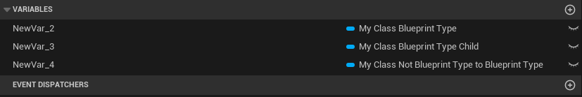

# BlueprintType

- **功能描述：**可当做变量类型
- **引擎模块：**Blueprint
- **元数据类型：**bool
- **作用机制：**Meta增加[BlueprintType](../../../../Meta/Blueprint/BlueprintType.md)
- **关联项：**[NotBlueprintType ](../NotBlueprintType.md)
- **常用程度：**★★★★★

可当做变量类型。

关键是设置BlueprintType和NotBlueprintType这两个metadata.

## 示例代码：

```cpp

/*
(BlueprintType = true, IncludePath = Class/MyClass_BlueprintType.h, ModuleRelativePath = Class/MyClass_BlueprintType.h)
 */
UCLASS(BlueprintType)
class INSIDER_API UMyClass_BlueprintType :public UObject
{
	GENERATED_BODY()
};

/*
(IncludePath = Class/MyClass_BlueprintType.h, ModuleRelativePath = Class/MyClass_BlueprintType.h)
*/
UCLASS()
class INSIDER_API UMyClass_BlueprintType_Child :public UMyClass_BlueprintType
{
	GENERATED_BODY()
};

/*
(IncludePath = Class/MyClass_BlueprintType.h, ModuleRelativePath = Class/MyClass_BlueprintType.h, NotBlueprintType = true)
*/
UCLASS(NotBlueprintType)
class INSIDER_API UMyClass_NotBlueprintType :public UObject
{
	GENERATED_BODY()
};

/*
(BlueprintType = true, IncludePath = Class/MyClass_BlueprintType.h, ModuleRelativePath = Class/MyClass_BlueprintType.h)
*/
UCLASS(BlueprintType)
class INSIDER_API UMyClass_NotBlueprintType_To_BlueprintType:public UMyClass_NotBlueprintType
{
	GENERATED_BODY()
};

/*
(IncludePath = Class/MyClass_BlueprintType.h, ModuleRelativePath = Class/MyClass_BlueprintType.h, NotBlueprintType = true)
*/
UCLASS(NotBlueprintType)
class INSIDER_API UMyClass_BlueprintType_To_NotBlueprintType:public UMyClass_BlueprintType
{
	GENERATED_BODY()
};

```

## 示例结果：

带有BlueprintType =true的才可以当作变量



## 原理：

在UEdGraphSchema_K2::IsAllowableBlueprintVariableType的3个重载函数分别判断UEnum，UClass，UScriptStruct能否当作变量。

```cpp
用UEdGraphSchema_K2::IsAllowableBlueprintVariableType来判断

const UClass* ParentClass = InClass;
while(ParentClass)
{
	// Climb up the class hierarchy and look for "BlueprintType" and "NotBlueprintType" to see if this class is allowed.
	if(ParentClass->GetBoolMetaData(FBlueprintMetadata::MD_AllowableBlueprintVariableType)
		|| ParentClass->HasMetaData(FBlueprintMetadata::MD_BlueprintSpawnableComponent))
	{
		return true;
	}
	else if(ParentClass->GetBoolMetaData(FBlueprintMetadata::MD_NotAllowableBlueprintVariableType))
	{
		return false;
	}
	ParentClass = ParentClass->GetSuperClass();
}
```