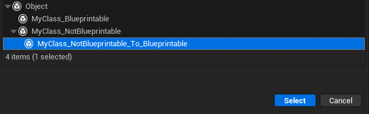

# Blueprintable

Type: bool
Feature: Blueprint
Description: 可以在蓝图里被继承，也可当变量类型
Example: UCLASS(Blueprintable)
class INSIDER_API UMyClass_Blueprintable :public UObject
{
GENERATED_BODY()
};
MetaOperation: |=true
Meta: IsBlueprintBase (../../Meta/Meta/IsBlueprintBase.md), BlueprintType (../../Meta/Meta/BlueprintType.md)
Status: Done
Sub-item: NotBlueprintable (NotBlueprintable.md)
Trait: Star

可以在蓝图里被继承，Blueprintable隐含也可当变量类型。当设置Blueprintable标记的时候，会隐含的设置上BlueprintType = true的metadata。去除的时候，也会相应的去除掉BlueprintType = true。

不过是否能够当做变量的规则，还是会依赖父类的Blueprint标记。因此以下这3个都是可以当做变量的。

其中UMyClass_Blueprintable_To_NotBlueprintable可以当做变量是因为父类UMyClass_Blueprintable可以当做变量，因此就继承了下来。

