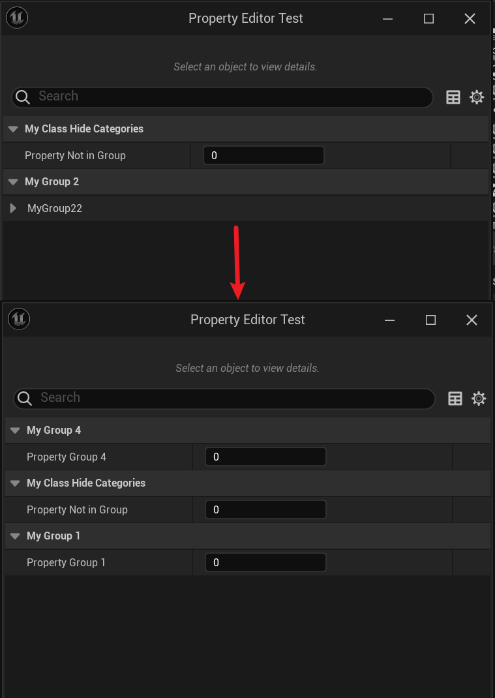

# HideCategories

- **功能描述：** 在类的ClassDefaults属性面板里隐藏某些Category的属性。
- **引擎模块：**Category
- **元数据类型：**strings=(abc，"d|e"，"x|y|z")
- **关联项：**[ShowCategories](../ShowCategories/ShowCategories.md)
- **常用程度：★★★★**

在类的ClassDefaults属性面板里隐藏某些Category的属性。

注意，要先在类里定义属性然后设置它的Category。HideCategories的信息会被UHT分析，并保存到UClass的元数据里去。HideCategories的信息可以被子类继承下来。

## 示例代码：

```cpp
UCLASS(Blueprintable, hideCategories = MyGroup1)
class INSIDER_API UMyClass_HideCategories :public UObject
{
	GENERATED_BODY()
public:
	UPROPERTY(EditAnywhere, BlueprintReadWrite, Category = MyGroup1)
		int Property_Group1;
	UPROPERTY(EditAnywhere, BlueprintReadWrite, Category = "MyGroup2 | MyGroup3")
		int Property_Group23;

	UPROPERTY(EditAnywhere, BlueprintReadWrite)
		int Property_NotInGroup;
};

/*
(BlueprintType = true, HideCategories = MyGroup2 | MyGroup3, IncludePath = Class/Display/MyClass_ShowCategories.h, IsBlueprintBase = true, ModuleRelativePath = Class/Display/MyClass_ShowCategories.h)
*/

UCLASS(Blueprintable, showCategories = MyGroup1, hideCategories = "MyGroup2 | MyGroup3")
class INSIDER_API UMyClass_HideCategoriesChild :public UMyClass_ShowCategories
{
	GENERATED_BODY()
public:

	UPROPERTY(EditAnywhere, BlueprintReadWrite, Category = "MyGroup2")
		int Property_Group2;

	UPROPERTY(EditAnywhere, BlueprintReadWrite, Category = "MyGroup3")
		int Property_Group3;

	UPROPERTY(EditAnywhere, BlueprintReadWrite, Category = MyGroup4)
		int Property_Group4;
};

```

## 示例效果：

注意这里，单独的MyGroup2和MyGroup3也都没有显示。所以判断的标准只要目录符合某个目录名字匹配就行。



## 原理：

在GetClassHideCategories中检查ClassHideCategoriesMetaKey元数据。

```cpp
void  FEditorCategoryUtils::GetClassShowCategories(const UStruct* Class, TArray<FString>& CategoriesOut)
{
	CategoriesOut.Empty();

	using namespace FEditorCategoryUtilsImpl;
	if (Class->HasMetaData(ClassShowCategoriesMetaKey))
	{
		const FString& ShowCategories = Class->GetMetaData(ClassShowCategoriesMetaKey);
		ShowCategories.ParseIntoArray(CategoriesOut, TEXT(" "), /*InCullEmpty =*/true);

		for (FString& Category : CategoriesOut)
		{
			Category = GetCategoryDisplayString(FText::FromString(Category)).ToString();
		}
	}
}

void FEditorCategoryUtils::GetClassHideCategories(const UStruct* Class, TArray<FString>& CategoriesOut, bool bHomogenize)
{
	CategoriesOut.Empty();

	using namespace FEditorCategoryUtilsImpl;
	if (Class->HasMetaData(ClassHideCategoriesMetaKey))
	{
		const FString& HideCategories = Class->GetMetaData(ClassHideCategoriesMetaKey);

		HideCategories.ParseIntoArray(CategoriesOut, TEXT(" "), /*InCullEmpty =*/true);
		
		if (bHomogenize)
		{
			for (FString& Category : CategoriesOut)
			{
				Category = GetCategoryDisplayString(Category);
			}
		}
	}
}
```