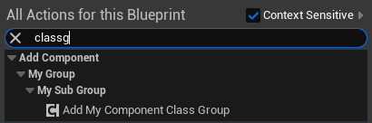

# ClassGroup

Type: string="a|b|c"
Feature: Blueprint, Editor
Description: 指示在虚幻编辑器的Actor浏览器中启用 组视图（Group View） 时，Actor浏览器 应在指定的 GroupName 中包含此类及此类的所有子类。
Example: ClassGroup=GroupName
MetaOperation: +=
Meta: ClassGroupNames (../../Meta/Meta/ClassGroupNames.md)
Status: Done

只对组件起作用。



在添加组件的时候：


```cpp
static FText GetDefaultMenuCategory(const TSubclassOf<UActorComponent> ComponentClass)
	{
		TArray<FString> ClassGroupNames;
		ComponentClass->GetClassGroupNames(ClassGroupNames);

if (FKismetEditorUtilities::IsClassABlueprintSpawnableComponent(Class))
				{
					TArray<FString> ClassGroupNames;
					Class->GetClassGroupNames(ClassGroupNames);
```

Metadata中的ClassGroupNames，被使用方法是UClass::GetClassGroupNames，这个又是在BlueprintComponentNodeSpawner中被使用。还有一个使用地方是ComponentTypeRegistry.cpp中，也是在判断Component。因此这个ClassGroup确实是只被Component使用的。