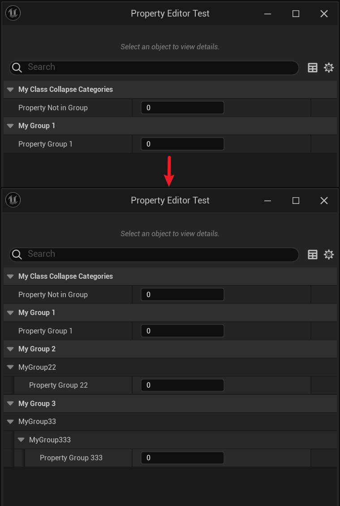

# CollapseCategories

Type: bool
Feature: DetailsPanel
Description: 隐藏带有多层Category的属性。 此说明符会传播到子类，可由DontCollapseCategories说明符覆盖。
EClassFlagsOperation: |=
EClassFlags: CLASS_CollapseCategories (../../Flags/EClassFlags/CLASS_CollapseCategories.md)
Status: Done
Sub-item: DontCollapseCategories (DontCollapseCategories.md)

在类的属性面板里隐藏所有带Category的属性，但是只对带有多个嵌套Category的属性才起作用。

```cpp
if (Specifier == TEXT("collapseCategories"))
{
	// Class' properties should not be shown categorized in the editor.
	ClassFlags |= CLASS_CollapseCategories;
}
else if (Specifier == TEXT("dontCollapseCategories"))
{
	// Class' properties should be shown categorized in the editor.
	ClassFlags &= ~CLASS_CollapseCategories;
}
```

```cpp
/*
ClassFlags: CLASS_MatchedSerializers | CLASS_Native | CLASS_CollapseCategories | CLASS_RequiredAPI | CLASS_TokenStreamAssembled | CLASS_Intrinsic | CLASS_Constructed
*/
UCLASS(Blueprintable, CollapseCategories)
class INSIDER_API UMyClass_CollapseCategories :public UObject
{
	GENERATED_BODY()
public:
	UPROPERTY(EditAnywhere, BlueprintReadWrite)
		int Property_NotInGroup;
	UPROPERTY(EditAnywhere, BlueprintReadWrite, Category = "MyGroup1")
		int Property_Group1;
	UPROPERTY(EditAnywhere, BlueprintReadWrite, Category = "MyGroup2|MyGroup22")
		int Property_Group22;

	UPROPERTY(EditAnywhere, BlueprintReadWrite, Category = "MyGroup3|MyGroup33|MyGroup333")
		int Property_Group333;
};

/*
ClassFlags: CLASS_MatchedSerializers | CLASS_Native | CLASS_RequiredAPI | CLASS_TokenStreamAssembled | CLASS_Intrinsic | CLASS_Constructed 
*/
UCLASS(Blueprintable, dontCollapseCategories)
class INSIDER_API UMyClass_DontCollapseCategories :public UMyClass_CollapseCategories
{
	GENERATED_BODY()
public:
};
```

