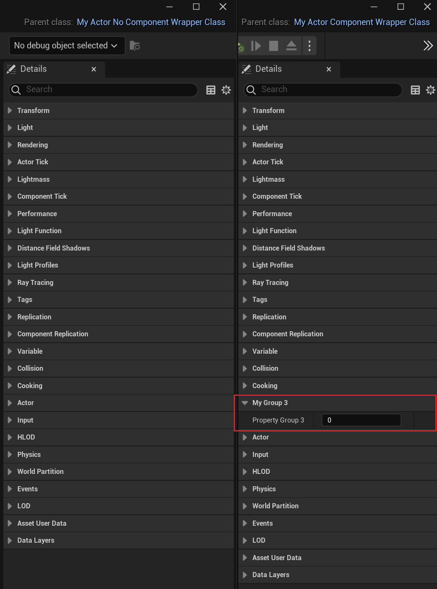

# ComponentWrapperClass

Description: 指定该类为一个简单的封装类。控制子类的hideCategories和showCategories都被忽略。
Feature: DetailsPanel
Type: bool
MetaOperation: +=
Meta: IgnoreCategoryKeywordsInSubclasses (../../Meta/Meta/IgnoreCategoryKeywordsInSubclasses.md)
Status: Done

常常这么出现：ConversionRoot, ComponentWrapperClass, meta = (ChildCanTick))

指定该类为一个简单的组件封装类。如名字所说，为一个组件的包装类，其实就是一个Actor简单的只包含一个Component。这种简单的包装关系，典型的例子是ALight包装ULightComponent，ASkeletalMeshActor包装USkeletalMeshComponent。

控制子类上面定义的hideCategories和showCategories都被忽略，而直接采用基类上的目录定义，也就是本组件包装类上的目录设置。当前源码里只有BlueprintEditorUtils.cpp在用，而这是蓝图打开的过程，因此这个只有在双击打开一个蓝图的时候才起作用。普通的UObject类，直接用testprops创建的窗口，因为不是双击打开蓝图，因此是无法生效的。

ComponentWrapperClass在源码里搜了一下，只有一些Actor在用。

```cpp
case EClassMetadataSpecifier::ComponentWrapperClass:
	MetaData.Add(NAME_IgnoreCategoryKeywordsInSubclasses, TEXT("true"));    //"IgnoreCategoryKeywordsInSubclasses"
	break;
////////////////////////////////////////////////////////////////////////////////
E:\P4V\Engine\Source\Editor\UnrealEd\Private\Kismet2\BlueprintEditorUtils.cpp
void FBlueprintEditorUtils::RecreateClassMetaData(UBlueprint* Blueprint, UClass* Class, bool bRemoveExistingMetaData)

if (!ParentClass->HasMetaData(FBlueprintMetadata::MD_IgnoreCategoryKeywordsInSubclasses)) //如果没有这个设置
		{
			// we want the categories just as they appear in the parent class 
			// (set bHomogenize to false) - especially since homogenization 
			// could inject spaces

			//以下这些操作是当没有这个设置的时候，子类会继承父类的目录设置。
			FEditorCategoryUtils::GetClassHideCategories(ParentClass, AllHideCategories, /*bHomogenize =*/false);
			if (ParentClass->HasMetaData(TEXT("ShowCategories")))
			{
				Class->SetMetaData(TEXT("ShowCategories"), *ParentClass->GetMetaData("ShowCategories"));
			}
			if (ParentClass->HasMetaData(TEXT("AutoExpandCategories")))
			{
				Class->SetMetaData(TEXT("AutoExpandCategories"), *ParentClass->GetMetaData("AutoExpandCategories"));
			}
			if (ParentClass->HasMetaData(TEXT("AutoCollapseCategories")))
			{
				Class->SetMetaData(TEXT("AutoCollapseCategories"), *ParentClass->GetMetaData("AutoCollapseCategories"));
			}
			if (ParentClass->HasMetaData(TEXT("PrioritizeCategories")))
			{
				Class->SetMetaData(TEXT("PrioritizeCategories"), *ParentClass->GetMetaData("PrioritizeCategories"));
			}
		}
```

典型用法:

```cpp
UCLASS(Blueprintable, BlueprintType, ComponentWrapperClass, hideCategories = MyGroup3)	//依然会显示出Property_Group3
class AMyActor_ComponentWrapperClass : public AActor
{
	GENERATED_UCLASS_BODY()
public:
	UPROPERTY(BlueprintReadOnly, VisibleAnywhere)
		class UPointLightComponent* PointLightComponent;

	UPROPERTY(EditAnywhere, BlueprintReadWrite, Category = MyGroup3)
		int Property_Group3;
};

UCLASS(Blueprintable, BlueprintType, hideCategories = MyGroup3)
class AMyActor_NoComponentWrapperClass : public AActor //Property_Group3会被隐藏
{
	GENERATED_UCLASS_BODY()
public:
	UPROPERTY(BlueprintReadOnly, VisibleAnywhere)
		class UPointLightComponent* PointLightComponent;

	UPROPERTY(EditAnywhere, BlueprintReadWrite, Category = MyGroup3)
		int Property_Group3;
};
```

子类的实际作用效果：

