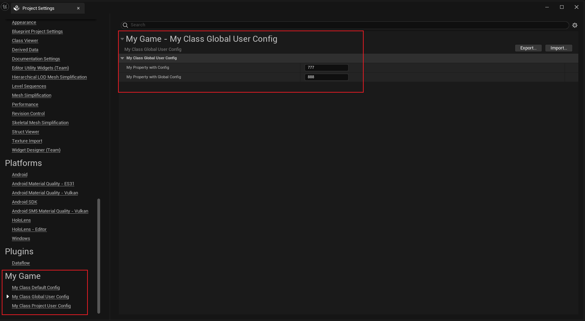

# GlobalUserConfig

- **功能描述：** 指定保存到的配置文件层级是全局用户设置 Engine/Config/UserXXX.ini。
- **引擎模块：**Config
- **元数据类型：**bool
- **作用机制：**在ClassFlags中增加[CLASS_GlobalUserConfig](../../../../Flags/EClassFlags/CLASS_GlobalUserConfig.md)
- **关联项：**[Config](../Config.md)
- **常用程度：★★★**

指定保存到的配置文件层级是全局用户设置 Engine/Config/UserXXX.ini。

## 示例代码：

属性用Config或者GlobalConfig都是可以的。

```cpp
UCLASS(Config = MyGame, GlobalUserConfig)
class INSIDER_API UMyClass_GlobalUserConfig:public UDeveloperSettings
{
	GENERATED_BODY()
public:
	/** Gets the settings container name for the settings, either Project or Editor */
	virtual FName GetContainerName() const override { return TEXT("Project"); }
	/** Gets the category for the settings, some high level grouping like, Editor, Engine, Game...etc. */
	virtual FName GetCategoryName() const override { return TEXT("MyGame"); }
	/** The unique name for your section of settings, uses the class's FName. */
	virtual FName GetSectionName() const override { return TEXT("MyGlobalGame"); }
public:
	UPROPERTY(EditAnywhere, BlueprintReadWrite, Config)
		int32 MyPropertyWithConfig = 123;

	UPROPERTY(EditAnywhere, BlueprintReadWrite, GlobalConfig)
		int32 MyPropertyWithGlobalConfig = 456;
};

保存到C:\Users\jack.fu\AppData\Local\Unreal Engine\Engine\Config\UserMyGame.ini
[/Script/Insider.UMyClass_GlobalUserConfig]
MyPropertyWithGlobalConfig=999
```

## 示例效果：



## 源码例子：

```cpp
UCLASS(config=Engine, globaluserconfig)
class ANDROIDPLATFORMEDITOR_API UAndroidSDKSettings : public UObject
{
public:
	GENERATED_UCLASS_BODY()

	// Location on disk of the Android SDK (falls back to ANDROID_HOME environment variable if this is left blank)
	UPROPERTY(GlobalConfig, EditAnywhere, Category = SDKConfig, Meta = (DisplayName = "Location of Android SDK (the directory usually contains 'android-sdk-')"))
	FDirectoryPath SDKPath;

	// Location on disk of the Android NDK (falls back to NDKROOT environment variable if this is left blank)
	UPROPERTY(GlobalConfig, EditAnywhere, Category = SDKConfig, Meta = (DisplayName = "Location of Android NDK (the directory usually contains 'android-ndk-')"))
	FDirectoryPath NDKPath;

	// Location on disk of Java (falls back to JAVA_HOME environment variable if this is left blank)
	UPROPERTY(GlobalConfig, EditAnywhere, Category = SDKConfig, Meta = (DisplayName = "Location of JAVA (the directory usually contains 'jdk')"))
	FDirectoryPath JavaPath;
	
	// Which SDK to package and compile Java with (a specific version or (without quotes) 'latest' for latest version on disk, or 'matchndk' to match the NDK API Level)
	UPROPERTY(GlobalConfig, EditAnywhere, Category = SDKConfig, Meta = (DisplayName = "SDK API Level (specific version, 'latest', or 'matchndk' - see tooltip)"))
	FString SDKAPILevel;

	// Which NDK to compile with (a specific version or (without quotes) 'latest' for latest version on disk). Note that choosing android-21 or later won't run on pre-5.0 devices.
	UPROPERTY(GlobalConfig, EditAnywhere, Category = SDKConfig, Meta = (DisplayName = "NDK API Level (specific version or 'latest' - see tooltip)"))
	FString NDKAPILevel;
};
```