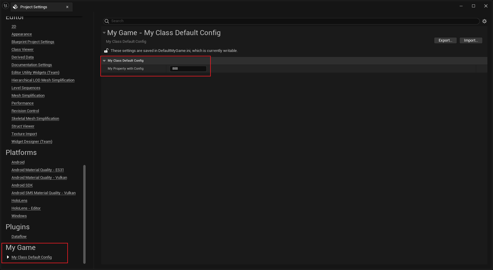

# DefaultConfig

Description: 指定在编辑器里把Settings自动保存到Project/Config/DefaultXXX.ini里去
Feature: Config
Type: bool
EClassFlagsOperation: |=
EClassFlags: CLASS_DefaultConfig (../../Flags/EClassFlags/CLASS_DefaultConfig.md)
Status: Done

代码里要使用Settings->TryUpdateDefaultConfigFile();，但发现TryUpdateDefaultConfigFile不管有没有DefaultConfig都可以调用，都可以保存到Default里。因此应该调用哪个SaveConfig是可以手动指定的，但是在编辑器里编辑的时候，则可以通过写好的代码来处理好逻辑。如SSettingsEditor.cpp里NotifyPostChange中调用Section->Save();则可以在内部再调用如下代码：

```cpp
bool FSettingsSection::Save()
{
	if (ModifiedDelegate.IsBound() && !ModifiedDelegate.Execute())
	{
		return false;
	}

	if (SaveDelegate.IsBound())
	{
		return SaveDelegate.Execute();
	}

	//更新到正确的文件里
	if (SettingsObject.IsValid())
	{
		if (SettingsObject->GetClass()->HasAnyClassFlags(CLASS_DefaultConfig))
		{
			SettingsObject->TryUpdateDefaultConfigFile();
		}
		else if (SettingsObject->GetClass()->HasAnyClassFlags(CLASS_GlobalUserConfig))
		{
			SettingsObject->UpdateGlobalUserConfigFile();
		}
		else if (SettingsObject->GetClass()->HasAnyClassFlags(CLASS_ProjectUserConfig))
		{
			SettingsObject->UpdateProjectUserConfigFile();
		}
		else
		{
			SettingsObject->SaveConfig();
		}

		return true;
	}

	return false;
}
```

测试代码：

```cpp
UCLASS(Config = MyGame,DefaultConfig)
class INSIDER_API UMyClass_DefaultConfig :public UDeveloperSettings
{
	GENERATED_BODY()
public:
	/** Gets the settings container name for the settings, either Project or Editor */
	virtual FName GetContainerName() const override { return TEXT("Project"); }
	/** Gets the category for the settings, some high level grouping like, Editor, Engine, Game...etc. */
	virtual FName GetCategoryName() const override { return TEXT("MyGame"); }
	/** The unique name for your section of settings, uses the class's FName. */
	virtual FName GetSectionName() const override { return TEXT("MyGame"); }
public:
	UPROPERTY(EditAnywhere, BlueprintReadWrite, Config)
		int32 MyPropertyWithConfig = 123;
};

//保存的结果：
//Config/DefaultMyGame.ini
[/Script/Insider.MyClass_DefaultConfig]
MyPropertyWithConfig=888

```

截图：

