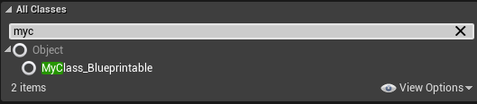

# NotBlueprintable

Description: 不可在蓝图里继承
Feature: Blueprint
Type: bool
MetaOperation: &=~
Meta: BlueprintType (../../Meta/Meta/BlueprintType.md), IsBlueprintBase (../../Meta/Meta/IsBlueprintBase.md)
Status: Done
Parent item: Blueprintable (Blueprintable.md)
Trait: Star

可以在蓝图里被继承，Blueprintable隐含也可当变量类型

