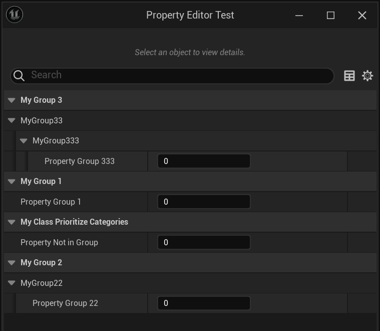

# PrioritizeCategories

Type: strings=(abc，"d|e"，"x|y|z")
Feature: DetailsPanel
Description: 把指定的属性目录优先显示在前面
MetaOperation: +=
Meta: PrioritizeCategories (../../Meta/Meta/PrioritizeCategories.md)
Status: Done

在UClass::GetPrioritizeCategories(TArray<FString>& OutPrioritizedCategories)中获取优先级目录。原理是按照指定的顺序放到SortedCategories里，所以就会被首先创建出属性目录来。

```cpp
TArray<FString> ClassPrioritizeCategories;
Class->GetPrioritizeCategories(ClassPrioritizeCategories);
for (const FString& ClassPrioritizeCategory : ClassPrioritizeCategories)
{
	FName PrioritizeCategoryName = FName(ClassPrioritizeCategory);
	SortedCategories.AddUnique(PrioritizeCategoryName);
	PrioritizeCategories.AddUnique(PrioritizeCategoryName);
}

UCLASS(Blueprintable, PrioritizeCategories= ("MyGroup3|MyGroup33|MyGroup333","MyGroup1"))
class INSIDER_API UMyClass_PrioritizeCategories :public UObject
{
	GENERATED_BODY()
public:
	UPROPERTY(EditAnywhere, BlueprintReadWrite)
		int Property_NotInGroup;
	UPROPERTY(EditAnywhere, BlueprintReadWrite, Category = "MyGroup1")
		int Property_Group1;
	UPROPERTY(EditAnywhere, BlueprintReadWrite, Category = "MyGroup2|MyGroup22")
		int Property_Group22;

	UPROPERTY(EditAnywhere, BlueprintReadWrite, Category = "MyGroup3|MyGroup33|MyGroup333")
		int Property_Group333;
};
```

