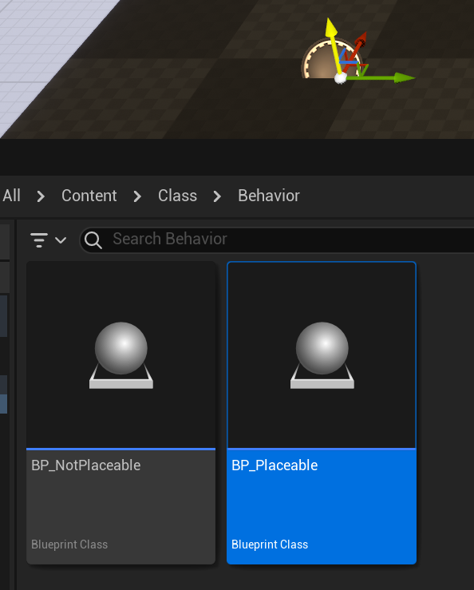

# Placeable

- **功能描述：**  标明该Actor可以放置在关卡里。
- **引擎模块：** Scene
- **元数据类型：** bool
- **作用机制：** 在ClassFlags中移除[CLASS_NotPlaceable](../../../../Flags/EClassFlags/CLASS_NotPlaceable.md)
- **关联项：** [NotPlaceable](../NotPlaceable/NotPlaceable.md)
- **常用程度：★★★**

标明该Actor可以放置在关卡里。

默认情况下是placeable的，因此源码里目前没有用到Placeable的地方。

子类可使用NotPlaceable说明符覆盖此标志，正如AInfo之类的上面自己设置NotPlaceable。

指示可在编辑器中创建此类，而且可将此类放置到关卡、UI场景或蓝图（取决于类类型）中。此标志会传播到所有子类；

placeable没法清除父类的notplaceable标记。

## 示例代码：

```cpp
UCLASS(Blueprintable, BlueprintType,placeable)	
class INSIDER_API AMyActor_Placeable :public AMyActor_NotPlaceable
{
	GENERATED_BODY()
};
error : The 'placeable' specifier cannot override a 'nonplaceable' base class. Classes are assumed to be placeable by default. Consider whether using the 'abstract' specifier on the base class would work.
```

## 示例效果：

