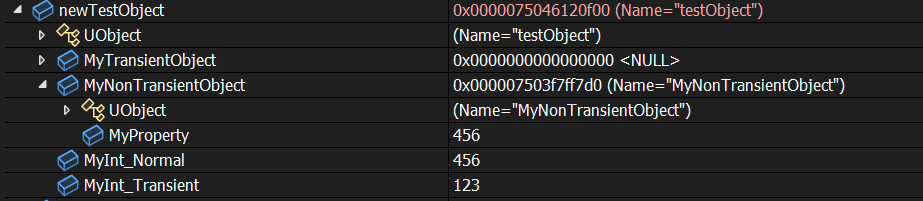

# Transient

- **功能描述：**指定该类的所有对象都略过序列化。

- **引擎模块：**Serialization
- **元数据类型：**bool
- **作用机制：**在ClassFlags中添加[CLASS_Transient](../../../../Flags/EClassFlags/CLASS_Transient.md)
- **关联项：**[NonTransient](../NonTransient.md)
- **常用程度：**★★★

指定该类的所有对象都略过序列化。

- 从不将属于此类的对象保存到磁盘。此说明符会传播到子类，但是可由NonTransient说明符覆盖。可以在子类被改写.
- 会造成相应Object的RF_Transient标记。
- 注意：UPROPERTY(Transient)只是指定这一个特定的属性不序列化。而UCLASS(Transient)是作用于该类的所有对象。

## 示例代码：

```cpp
UCLASS(Blueprintable, Transient)
class INSIDER_API UMyClass_Transient :public UObject
{
	GENERATED_BODY()
public:
	UPROPERTY(EditAnywhere, BlueprintReadWrite)
		int32 MyProperty = 123;
};

UCLASS(Blueprintable, NonTransient)
class INSIDER_API UMyClass_NonTransient :public UObject
{
	GENERATED_BODY()
public:
	UPROPERTY(EditAnywhere, BlueprintReadWrite)
		int32 MyProperty = 123;
};

UCLASS(Blueprintable, BlueprintType)
class INSIDER_API UMyClass_Transient_Test :public UObject
{
	GENERATED_BODY()
public:
	UPROPERTY(EditAnywhere, BlueprintReadWrite)
		UMyClass_Transient* MyTransientObject;
	UPROPERTY(EditAnywhere, BlueprintReadWrite)
		UMyClass_NonTransient* MyNonTransientObject;

	UPROPERTY(EditAnywhere, BlueprintReadWrite)
		int32 MyInt_Normal=123;
		UPROPERTY(EditAnywhere, BlueprintReadWrite,Transient)
		int32 MyInt_Transient =123;
};
```

序列化对象指针关键是采用FObjectProperty里的SerializeItem方法Slot << ObjectValue;

不能采用Actor的Class Default来测试，因为：

Transient properties are serialized for (Blueprint) Class Default Objects but should not be serialized for any 'normal' instances of classes.

```cpp
UCLASS(Blueprintable, BlueprintType)
class INSIDER_API AMyActor_Transient_Test :public AActor
{
	GENERATED_BODY()
public:
	UPROPERTY(EditAnywhere, BlueprintReadWrite)
		UMyClass_Transient* MyTransientObject;
	UPROPERTY(EditAnywhere, BlueprintReadWrite)
		UMyClass_NonTransient* MyNonTransientObject;

	UPROPERTY(EditAnywhere, BlueprintReadWrite)
		int32 MyInt_Normal=123;
		UPROPERTY(EditAnywhere, BlueprintReadWrite,Transient)
		int32 MyInt_Transient =123;
};
```

也不能用FObjectAndNameAsStringProxyArchive测试，因为FObjectAndNameAsStringProxyArchive内部在序列化对象的时候，会先查找名字。

```cpp
FArchive& FObjectAndNameAsStringProxyArchive::operator<<(UObject*& Obj)
{
	if (IsLoading())
	{
		// load the path name to the object
		FString LoadedString;
		InnerArchive << LoadedString;
		// look up the object by fully qualified pathname
		Obj = FindObject<UObject>(nullptr, *LoadedString, false);
		// If we couldn't find it, and we want to load it, do that
		if(!Obj && bLoadIfFindFails)
		{
			Obj = LoadObject<UObject>(nullptr, *LoadedString);
		}
	}
	else
	{
		// save out the fully qualified object name
		FString SavedString(Obj->GetPathName());
		InnerArchive << SavedString;
	}
	return *this;
}
```

因此采用Package的测试：

```cpp

FString packageName = TEXT("/Game/MyTestPackage");
FString assetPath = FPackageName::LongPackageNameToFilename(packageName, FPackageName::GetAssetPackageExtension());
UPackage* package = CreatePackage(*packageName);
FSavePackageArgs saveArgs{};
saveArgs.Error = GError;

//ObjectFlags:	RF_NoFlags
UMyClass_Transient_Test* testObject = NewObject<UMyClass_Transient_Test>(package, TEXT("testObject"));	
//ObjectFlags:	RF_Transient 
testObject->MyTransientObject = NewObject<UMyClass_Transient>(testObject, TEXT("MyTransientObject"));	
//ObjectFlags:	RF_NoFlags
testObject->MyNonTransientObject = NewObject<UMyClass_NonTransient>(testObject, TEXT("MyNonTransientObject"));	

testObject->MyTransientObject->MyProperty = 456;
testObject->MyNonTransientObject->MyProperty = 456;
testObject->MyInt_Normal = 456;
testObject->MyInt_Transient = 456;

bool result = UPackage::SavePackage(package, testObject, *assetPath, saveArgs);
```

在保存完成之后，重新加载Package:

```cpp
FString packageName = TEXT("/Game/MyTestPackage");
FString assetPath = FPackageName::LongPackageNameToFilename(packageName, FPackageName::GetAssetPackageExtension());

UPackage* package = LoadPackage(nullptr, *assetPath, LOAD_None);
package->FullyLoad();

UMyClass_Transient_Test* newTestObject=LoadObject<UMyClass_Transient_Test>(package, TEXT("testObject"),*assetPath);
```

## 示例效果：

可以看到MyTransientObject 并没有被序列化到磁盘上，因此不会加载出来。



## 原理：

在SavePackage的时候：RF_Transient会导致这个对象不会被HarvestExport，不会被放进SaveContext里

```cpp
void FPackageHarvester::TryHarvestExport(UObject* InObject)
{
	// Those should have been already validated
	check(InObject && InObject->IsInPackage(SaveContext.GetPackage()));

	// Get the realm in which we should harvest this export
	EIllegalRefReason Reason = EIllegalRefReason::None;
	ESaveRealm HarvestContext = GetObjectHarvestingRealm(InObject, Reason);
	if (!SaveContext.GetHarvestedRealm(HarvestContext).IsExport(InObject))
	{
		SaveContext.MarkUnsaveable(InObject);
		bool bExcluded = false;
		if (!InObject->HasAnyFlags(RF_Transient))
		{
			bExcluded = ConditionallyExcludeObjectForTarget(SaveContext, InObject, HarvestContext);
		}
		if (!InObject->HasAnyFlags(RF_Transient) && !bExcluded)
		{
			// It passed filtering so mark as export
			HarvestExport(InObject, HarvestContext);
		}

		// If we have a illegal ref reason, record it
		if (Reason != EIllegalRefReason::None)
		{
			SaveContext.RecordIllegalReference(CurrentExportDependencies.CurrentExport, InObject, Reason);
		}
	}
}
```