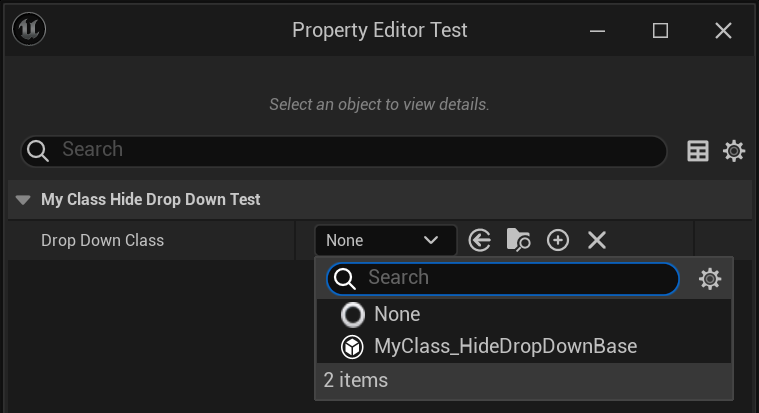

# HideDropDown

- **功能描述：** 在类选择器中隐藏此类
- **引擎模块：**TypePicker
- **元数据类型：**bool
- **作用机制：**在ClassFlags中添加[CLASS_HideDropDown](../../../../Flags/EClassFlags/CLASS_HideDropDown.md)
- **常用程度：★★**

在类选择器中隐藏此类，通常是TSubClassOf触发，或者Class变量触发的类选择窗口。这个时候，这个标识符可以阻止其出现。在源码里的使用，通常是一些旧的废弃的类或者Test类，Abstract类和基类。

## 示例代码：

```cpp
UCLASS(Blueprintable)
class INSIDER_API UMyClass_HideDropDownBase :public UObject
{
	GENERATED_BODY()
public:
};

UCLASS(Blueprintable, hidedropdown)
class INSIDER_API UMyClass_HideDropDown :public UMyClass_HideDropDownBase
{
	GENERATED_BODY()
public:
	UPROPERTY(EditAnywhere, BlueprintReadWrite)
		int32 MyProperty;
};

UCLASS(Blueprintable, hidedropdown)
class INSIDER_API UMyClass_NoHideDropDown :public UMyClass_HideDropDownBase
{
	GENERATED_BODY()
public:
	UPROPERTY(EditAnywhere, BlueprintReadWrite)
		int32 MyProperty;
};

UCLASS(Blueprintable)
class INSIDER_API UMyClass_HideDropDown_Test :public UObject
{
	GENERATED_BODY()
public:
	UPROPERTY(EditAnywhere, BlueprintReadWrite)
	TSubclassOf<UMyClass_HideDropDownBase> DropDownClass;
};
```

## 示例结果：



## 原理：

HideDropDown会造成CLASS_HideDropDown标记，从而在类型UI定制化的列表里把该类剔除出去。

```cpp
template <typename TClass>
bool FPropertyEditorClassFilter::IsClassAllowedHelper(TClass InClass)
{
	bool bMatchesFlags = !InClass->HasAnyClassFlags(CLASS_Hidden | CLASS_HideDropDown | CLASS_Deprecated) &&
		(bAllowAbstract || !InClass->HasAnyClassFlags(CLASS_Abstract));

	if (bMatchesFlags && InClass->IsChildOf(ClassPropertyMetaClass)
		&& (!InterfaceThatMustBeImplemented || InClass->ImplementsInterface(InterfaceThatMustBeImplemented)))
	{
		auto PredicateFn = [InClass](const UClass* Class)
		{
			return InClass->IsChildOf(Class);
		};

		if (DisallowedClassFilters.FindByPredicate(PredicateFn) == nullptr &&
			(AllowedClassFilters.Num() == 0 || AllowedClassFilters.FindByPredicate(PredicateFn) != nullptr))
		{
			return true;
		}
	}

	return false;
}
```