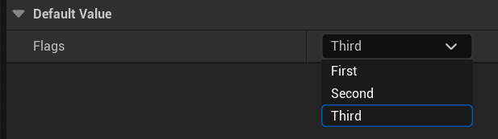

# Flags

Description: 指定作为一个标志
Type: bool
Feature: Trait
Status: Done
EEnumFlags: Flags (../../Flags/EEnumFlags/Flags.md)

指定作用的地方是当把一个值输出为字符串的时候，如果输出。一种是直接查找精确相等的值，然后查找特定的枚举值麻烦。第二种就是把它当做标志，输出符合相应标记的“A | B | C”这种格式的值。但是要注意其枚举值是完全没有影响变化的。跟直接把枚举值定义为标记是不同的。

```cpp
FString UEnum::GetValueOrBitfieldAsString(int64 InValue) const
{
	if (!HasAnyEnumFlags(EEnumFlags::Flags) || InValue == 0)
	{
		return GetNameStringByValue(InValue);
	}
	else
	{
		FString BitfieldString;
		bool WroteFirstFlag = false;
		while (InValue != 0)
		{
			int64 NextValue = 1ll << FMath::CountTrailingZeros64(InValue);
			InValue = InValue & ~NextValue;
			if (WroteFirstFlag)
			{
				// We don't just want to use the NameValuePair.Key because we want to strip enum class prefixes
				BitfieldString.Appendf(TEXT(" | %s"), *GetNameStringByValue(NextValue));
			}
			else
			{
				// We don't just want to use the NameValuePair.Key because we want to strip enum class prefixes
				BitfieldString.Appendf(TEXT("%s"), *GetNameStringByValue(NextValue));
				WroteFirstFlag = true;
			}
		}
		return BitfieldString;
	}
}
```

蓝图中的表示



注意和meta(bitflags)的区分，