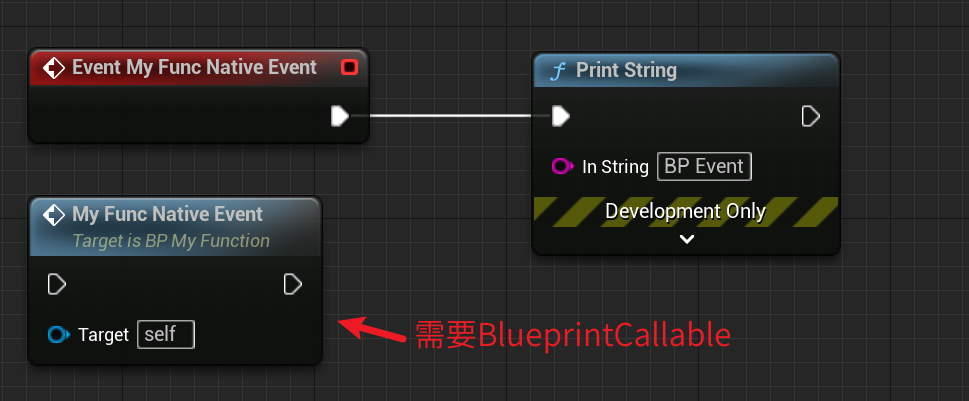

# BlueprintNativeEvent

- **功能描述：** 可以在蓝图总覆盖实现，但是也在C++中提供一个默认实现。

- **元数据类型：** bool
- **引擎模块：** Blueprint
- **作用机制：** 在FunctionFlags中增加[FUNC_Event](../../../../Flags/EFunctionFlags/FUNC_Event.md)、[FUNC_BlueprintEvent](../../../../Flags/EFunctionFlags/FUNC_BlueprintEvent.md)
- **常用程度：** ★★★★★

可以在蓝图总覆盖实现，但是也在C++中提供一个默认实现。

需要在CPP中声明名称与主函数相同的附加函数，但是末尾添加了_Implementation。如果未找到任何蓝图覆盖，该自动生成的代码将调用“ [FunctionName]_Implementation”方法。一般用在OnXXX之类的函数上，在C++提供实现，这样如果蓝图中没有覆盖的时候，就可以默认调用C++中默认实现版本。
BlueprintNativeEvent，没加BlueprintCallable的话就只能在CPP里调用，因此一般也要配合加上BlueprintCallable。

## 测试代码：

```cpp
//FunctionFlags:	FUNC_Native | FUNC_Event | FUNC_Public | FUNC_BlueprintCallable | FUNC_BlueprintEvent 
UFUNCTION(BlueprintCallable, BlueprintNativeEvent)
void MyFunc_NativeEvent();

void AMyFunction_Default::MyFunc_NativeEvent_Implementation()
{
	GEngine->AddOnScreenDebugMessage(-1, 3.f, FColor::Red, "MyFunc_NativeEvent_Implementation");
}
```

## 效果展示：



## 原理：

在调用MyFunc_NativeEvent的时候，内部FindFunctionChecked会根据名字查找，如果在蓝图中有定义，则会找到蓝图中的实现版本。否则的话，则会找到execMyFunc_NativeEvent这个实现版本，从而调用MyFunc_NativeEvent_Implementation。

```cpp
DEFINE_FUNCTION(AMyFunction_Default::execMyFunc_NativeEvent)
{
	P_FINISH;
	P_NATIVE_BEGIN;
	P_THIS->MyFunc_NativeEvent_Implementation();
	P_NATIVE_END;
}

void AMyFunction_Default::MyFunc_NativeEvent()
{
	ProcessEvent(FindFunctionChecked(NAME_AMyFunction_Default_MyFunc_NativeEvent),NULL);
}
```