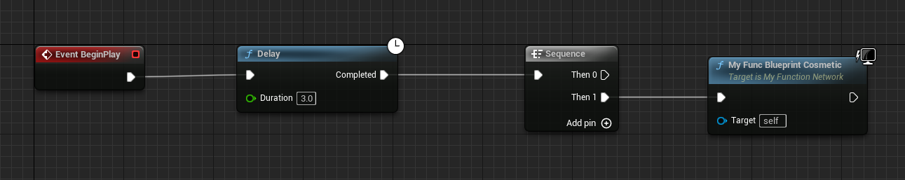

# BlueprintCosmetic

Description: 此函数为修饰性的，无法在DS上运行。
Type: bool
Feature: Network
Status: Done
+=EFunctionFlags: FUNC_BlueprintCosmetic (../../Flags/EFunctionFlags/FUNC_BlueprintCosmetic.md)

这个函数是修饰性的，所谓修饰性是指这个函数的内容是为了展现一些与逻辑无关的内容，比如动画音效特效等。因为DS并没有实际的画面输出，因此这些修饰性的函数是对DS无意义的。因此这些修饰性函数会被无视掉。

但是也注意在ListenServer或Client上，这二者都会允许运行。因为这两个端都需要画面展示。

测试代码：

```cpp
UFUNCTION(BlueprintCallable, BlueprintCosmetic)
void MyFunc_BlueprintCosmetic();
```

测试蓝图：节点上的电脑标记就是意味着只在客户端上运行。



结果输出

```cpp
MyFunc_BlueprintCosmetic    BP_Network_C_1  NM_ListenServer Local:ROLE_Authority    Remote:ROLE_SimulatedProxy
MyFunc_BlueprintCosmetic    BP_Network_C_1  NM_Client   Local:ROLE_SimulatedProxy   Remote:ROLE_Authority
MyFunc_BlueprintCosmetic    BP_Network_C_1  NM_Client   Local:ROLE_SimulatedProxy   Remote:ROLE_Authority
```

原理：

```cpp
int32 AActor::GetFunctionCallspace( UFunction* Function, FFrame* Stack )
{
// Dedicated servers don't care about "cosmetic" functions.
if (NetMode == NM_DedicatedServer && Function->HasAllFunctionFlags(FUNC_BlueprintCosmetic))
{
	DEBUG_CALLSPACE(TEXT("GetFunctionCallspace Blueprint Cosmetic Absorbed: %s"), *Function->GetName());
	return FunctionCallspace::Absorbed;
}
}
```