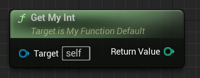

# BlueprintPure

Description: 此函数不对拥有它的对象产生任何影响，可在 蓝图 或 关卡蓝图 图表中执行。
Type: bool
Feature: Blueprint
Status: Done
+=EFunctionFlags: FUNC_BlueprintCallable (../../Flags/EFunctionFlags/FUNC_BlueprintCallable.md), FUNC_BlueprintPure (../../Flags/EFunctionFlags/FUNC_BlueprintPure.md)

指定作为一个纯函数，一般用于Get函数用来返回值。

因此不能用于void函数，否则会报错“error : BlueprintPure specifier is not allowed for functions with no return value and no output parameters.”

测试代码：

```cpp
UFUNCTION(BlueprintPure)
	int32 GetMyInt()const { return MyInt; }
private:
	int32 MyInt;
```

效果展示：

