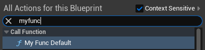

# BlueprintInternalUseOnly

- **功能描述：**指示不应向最终用户公开此函数。蓝图内部调用，不暴露给用户。

- **元数据类型：**bool
- **引擎模块：**Blueprint, UHT
- **作用机制：**在Meta中加入[BlueprintInternalUseOnly](../../../../Meta/Blueprint/BlueprintInternalUseOnly.md)、[BlueprintType](../../../../Meta/Blueprint/BlueprintType.md)
- **常用程度：**★★★

指示不应向最终用户公开此函数。蓝图内部调用，不暴露给用户。

等价于meta里加上BlueprintInternalUseOnly = true。默认情况下，BlueprintCallable/Pure的函数会生成UK2Node_CallFunction来调用。但BlueprintInternalUseOnly阻止了这一部分。

典型的用处有二：

一是在蓝图中隐藏该函数，但因为该函数依然有UFUNCTION，因此可以通过名字来反射调用该函数。虽然该用法比较稀少，但也算是一种用处。

二是引擎在别的地方会为该函数声明去按照特定的规则创建另一个蓝图函数节点，因此要隐藏掉按照默认规则创建的这个。这种用法就是引擎源码里大量在使用的用法。

## 示例代码1：

```cpp
UCLASS(Blueprintable, BlueprintType)
class INSIDER_API AMyFunction_Internal :public AActor
{
public:
	GENERATED_BODY()
public:
	//(BlueprintInternalUseOnly = true, BlueprintType = true, ModuleRelativePath = Function/MyFunction_Internal.h)
	//FunctionFlags:	FUNC_Final | FUNC_Native | FUNC_Public | FUNC_BlueprintCallable 
	UFUNCTION(BlueprintCallable, BlueprintInternalUseOnly)
	void MyFunc_InternalOnly() {}

	//FunctionFlags:	FUNC_Final | FUNC_Native | FUNC_Public | FUNC_BlueprintCallable 
	UFUNCTION(BlueprintCallable)
	void MyFunc_Default() {}
};
```

在蓝图中只有MyFunc_Default是可以调用的。因此可以理解为这个函数依然暴露到蓝图，但是却又被隐藏起来了。不能让用户自己直接调用，但是可以在代码里通过查找函数名之类的间接可以调用到。



在源码里找到一个示例，因此这个GetLevelScriptActor函数，可以不在蓝图中被调用，但是有可以通过名字查找到。方便生成一个UFunction以被注入到别的地方作为callback

```cpp
ULevelStreaming:
UFUNCTION(BlueprintPure, meta = (BlueprintInternalUseOnly = "true"))
ENGINE_API ALevelScriptActor* GetLevelScriptActor();

然后发现：
GetLevelScriptActorNode->SetFromFunction(ULevelStreaming::StaticClass()->FindFunctionByName(GET_FUNCTION_NAME_CHECKED(ULevelStreaming, GetLevelScriptActor)));
```

## 示例代码2：

实现代码就不贴了，可以自己去项目里查看。

```cpp
UCLASS(Blueprintable, BlueprintType,meta = (ExposedAsyncProxy = MyAsyncObject,HasDedicatedAsyncNode))
class INSIDER_API UMyFunction_Async :public UCancellableAsyncAction
{
public:
	GENERATED_BODY()
public:
	UPROPERTY(BlueprintAssignable)
	FDelayOutputPin Loop;

	UPROPERTY(BlueprintAssignable)
	FDelayOutputPin Complete;

	UFUNCTION(BlueprintCallable, meta = (BlueprintInternalUseOnly = "true", WorldContext = "WorldContextObject"), Category = "Flow Control")
	static UMyFunction_Async* DelayLoop(const UObject* WorldContextObject, const float DelayInSeconds, const int Iterations);

	virtual void Activate() override;

	UFUNCTION()
	static void Test();
private:
	const UObject* WorldContextObject = nullptr;
	float MyDelay = 0.f;
	int MyIterations = 0;
	bool Active = false;

	UFUNCTION()
	void ExecuteLoop();

	UFUNCTION()
	void ExecuteComplete();
};

```

## 示例效果：

假如注释掉上述源码的BlueprintInternalUseOnly ，会发现在蓝图里可以有两个DelayLoop。上面的一个是按UBlueprintAsyncActionBase规则生成的，第二个是按普通的蓝图函数规则生成的。明显这种情况下我们并不想同时出现两个来给用户造成困惑。因此要加上BlueprintInternalUseOnly 来阻止生成默认的蓝图节点。


## 原理：

关于UBlueprintAsyncActionBase的使用，UK2Node_BaseAsyncTask的函数实现里体现了书写继承于UBlueprintAsyncActionBase的规则，简单来说就是通过static 函数来当作Factory function，然后分析这个Proxy类的Delegate property来当作Pin。

如果不加BlueprintInternalUseOnly = "true”，则会生成两个函数。下面那个是普通static函数的生成。上面那个是分析UBlueprintAsyncActionBase生成的函数。

其中识别UBlueprintAsyncActionBase里面static函数作为FactoryFunction的流程是，BlueprintActionDatabaseImpl::GetNodeSpecificActions会触发UK2Node_AsyncAction::GetMenuActions，从而ActionRegistrar.RegisterClassFactoryActions，内部再判断RegisterClassFactoryActions_Utils::IsFactoryMethod(Function, UBlueprintAsyncActionBase)会通过（判断是static函数，并且返回类型是UBlueprintAsyncActionBase的子类对象），继而继续通过回调UBlueprintFunctionNodeSpawner::Create(FactoryFunc);创建一个工厂方法的nodeSpawner。

因此总结，此时的BlueprintInternalUseOnly 就是隐藏掉默认生成的那个。