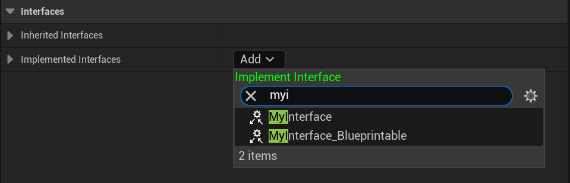

# Blueprintable

Description: 可以在蓝图中实现
Type: bool
Feature: Blueprint
MetaOperation: +=
Meta: IsBlueprintBase (../../Meta/Meta/IsBlueprintBase.md), BlueprintType (../../Meta/Meta/BlueprintType.md)
Status: Done
Sub-item: NotBlueprintable (NotBlueprintable.md)

是否可以在蓝图中实现。

```cpp
UINTERFACE(Blueprintable,MinimalAPI)
class UMyInterface_Blueprintable:public UInterface
{
	GENERATED_UINTERFACE_BODY()
};

class INSIDER_API IMyInterface_Blueprintable
{
	GENERATED_IINTERFACE_BODY()
public:
	UFUNCTION(BlueprintCallable, BlueprintImplementableEvent)
	void Func_ImplementableEvent() const;

	UFUNCTION(BlueprintCallable,BlueprintNativeEvent)
	void Func_NativeEvent() const;
};

UINTERFACE(NotBlueprintable,MinimalAPI)
class UMyInterface_NotBlueprintable:public UInterface
{
	GENERATED_UINTERFACE_BODY()
};

class INSIDER_API IMyInterface_NotBlueprintable
{
	GENERATED_IINTERFACE_BODY()
public:
//也不得定义蓝图函数，因为已经不能在蓝图中实现了
//UFUNCTION(BlueprintCallable, BlueprintImplementableEvent)
	//void Func_ImplementableEvent() const;

//	UFUNCTION(BlueprintCallable,BlueprintNativeEvent)
//	void Func_NativeEvent() const;
};
```

在蓝图中测试，发现UMyInterface_NotBlueprintable并不能找到。

