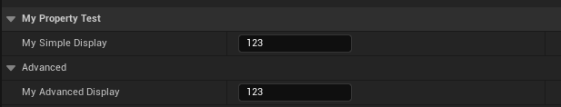

# AdvancedDisplay

Type: bool
Feature: DetailsPanel, Editor
Description: 被折叠到高级栏下，要手动打开。一般用在不太常用的属性上面。
EPropertyFlagsOperation: |=
EPropertyFlags: CPF_AdvancedDisplay (../../Flags/EPropertyFlags/CPF_AdvancedDisplay.md)
Status: Done

被折叠到高级栏下，要手动打开。一般用在不太常用的属性上面。

