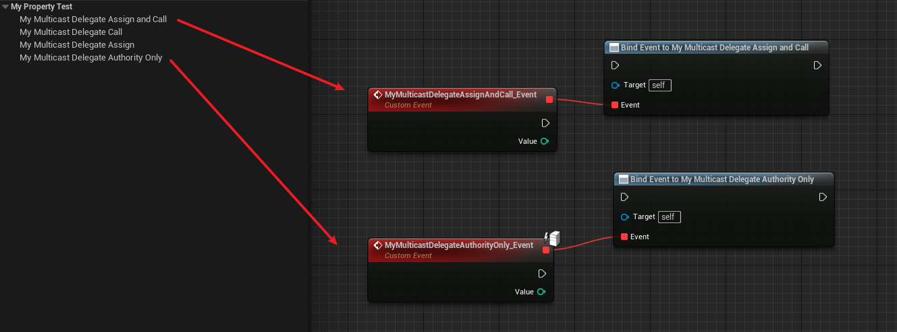

# BlueprintAuthorityOnly

- **功能描述：**只能绑定为BlueprintAuthorityOnly的事件，让该多播委托只接受在服务端运行的事件

- **元数据类型：**bool
- **引擎模块：**Blueprint, Network
- **限制类型：**Multicast Delegates
- **作用机制：**在PropertyFlags中加入[CPF_BlueprintAuthorityOnly](../../../../Flags/EPropertyFlags/CPF_BlueprintAuthorityOnly.md)
- **常用程度：**★★★

## 测试代码：

```cpp
UPROPERTY(EditAnywhere, BlueprintReadWrite, BlueprintAssignable, BlueprintCallable)
		FMyDynamicMulticastDelegate_One MyMulticastDelegateAssignAndCall;

UPROPERTY(EditAnywhere, BlueprintReadWrite, BlueprintAssignable, BlueprintCallable, BlueprintAuthorityOnly)
		FMyDynamicMulticastDelegate_One MyMulticastDelegateAuthorityOnly;
```

## 蓝图中表现：

