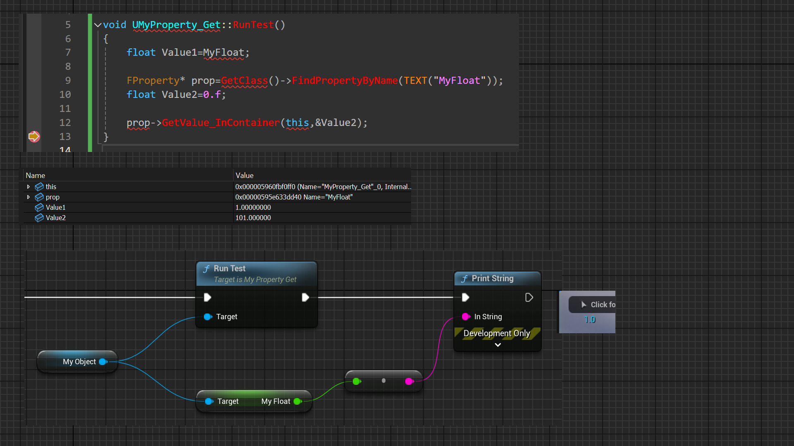

# Getter

功能描述: 为属性增加一个C++的Get函数，只在C++层面应用。
元数据类型: string="abc"
引擎模块: Blueprint
Example: Getter=GetterFunctionName
EPropertyFlagsOperation: |=
Status: Done
常用程度: 3

为属性增加一个C++的Get函数，只在C++层面应用。

- Getter上如不提供函数名，那就用默认的GetXXX的名字。也可以提供另外一个函数名。
- 这些Getter函数是不加UFUNCTION的，这点要和BlueprintGetter区分。
- 感觉更好的名字是NativeGetter。
- GetXXX的函数必须自己手写，否则UHT会报错。
- 我们当然也可以自己写GetSet函数，不需要写Getter和Setter的元数据。但写上Getter和Settter的好处是，万一在项目里别的地方，用到了反射来获取和设置值，这个时候如果没有标上Getter和Setter，就会直接从属性上获取值，从而跳过我们想要的自定义Get/Set流程。

测试代码：

```cpp
public:
	//GetterFunc:	Has Native Getter
	UPROPERTY(BlueprintReadWrite, Getter)
	float MyFloat = 1.0f;

	//GetterFunc:	Has Native Getter
	UPROPERTY(BlueprintReadWrite, Getter = GetMyCustomFloat)
	float MyFloat2 = 1.0f;
public:
	float GetMyFloat()const { return MyFloat + 100.f; }

	float GetMyCustomFloat()const { return MyFloat2 + 100.f; }
	
void UMyProperty_Get::RunTest()
{
	float Value1=MyFloat;

	FProperty* prop=GetClass()->FindPropertyByName(TEXT("MyFloat"));
	float Value2=0.f;

	prop->GetValue_InContainer(this,&Value2);
}
```

蓝图表现：

在测试的时候，可见如果是用GetValue_InContainer这种反射的方式来获取值，就会自动的调用到GetMyFloat，从而返回不同的值。

在蓝图里直接Get MyFloat 是依然是1.



原理：

UHT在分析Getter标记后，会在gen.cpp里生成相应的函数包装。在构建FProperty的时候，就会创建TPropertyWithSetterAndGetter，之后在GetSingleValue_InContainer的时候就会调用到CallGetter。

```cpp
void UMyProperty_Get::GetMyFloat_WrapperImpl(const void* Object, void* OutValue)
{
	const UMyProperty_Get* Obj = (const UMyProperty_Get*)Object;
	float& Result = *(float*)OutValue;
	Result = (float)Obj->GetMyFloat();
}

const UECodeGen_Private::FFloatPropertyParams Z_Construct_UClass_UMyProperty_Get_Statics::NewProp_MyFloat = { "MyFloat", nullptr, (EPropertyFlags)0x0010000000000004, UECodeGen_Private::EPropertyGenFlags::Float, RF_Public|RF_Transient|RF_MarkAsNative, nullptr, &UMyProperty_Get::GetMyFloat_WrapperImpl, 1, STRUCT_OFFSET(UMyProperty_Get, MyFloat), METADATA_PARAMS(UE_ARRAY_COUNT(NewProp_MyFloat_MetaData), NewProp_MyFloat_MetaData) };

template <typename PropertyType, typename PropertyParamsType>
PropertyType* NewFProperty(FFieldVariant Outer, const FPropertyParamsBase& PropBase)
{
	const PropertyParamsType& Prop = (const PropertyParamsType&)PropBase;
	PropertyType* NewProp = nullptr;

	if (Prop.SetterFunc || Prop.GetterFunc)
	{
		NewProp = new TPropertyWithSetterAndGetter<PropertyType>(Outer, Prop);
	}
	else
	{
		NewProp = new PropertyType(Outer, Prop);
	}
}

void FProperty::GetSingleValue_InContainer(const void* InContainer, void* OutValue, int32 ArrayIndex) const
{
	checkf(ArrayIndex <= ArrayDim, TEXT("ArrayIndex (%d) must be less than the property %s array size (%d)"), ArrayIndex, *GetFullName(), ArrayDim);
	if (!HasGetter())
	{
		// Fast path - direct memory access
		CopySingleValue(OutValue, ContainerVoidPtrToValuePtrInternal((void*)InContainer, ArrayIndex));
	}
	else
	{
		if (ArrayDim == 1)
		{
			// Slower but no mallocs. We can copy the value directly to the resulting param
			CallGetter(InContainer, OutValue);
		}
		else
		{
			// Malloc a temp value that is the size of the array. Getter will then copy the entire array to the temp value
			uint8* ValueArray = (uint8*)AllocateAndInitializeValue();
			GetValue_InContainer(InContainer, ValueArray);
			// Copy the item we care about and free the temp array
			CopySingleValue(OutValue, ValueArray + ArrayIndex * ElementSize);
			DestroyAndFreeValue(ValueArray);
		}
	}
}

```