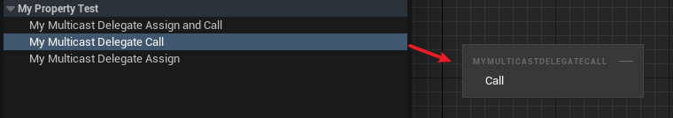

# BlueprintCallable

Type: bool
Feature: Blueprint
LimitedType: Multicast Delegates
Description: 在蓝图中可以调用这个多播委托
EPropertyFlagsOperation: |=
EPropertyFlags: CPF_BlueprintCallable (../../Flags/EPropertyFlags/CPF_BlueprintCallable.md)
Status: Done

C++的测试代码：

```cpp
DECLARE_DYNAMIC_MULTICAST_DELEGATE_OneParam(FMyDynamicMulticastDelegate_One, int32, Value);

UPROPERTY(EditAnywhere, BlueprintReadWrite, BlueprintAssignable, BlueprintCallable)
	FMyDynamicMulticastDelegate_One MyMulticastDelegateAssignAndCall;

UPROPERTY(EditAnywhere, BlueprintReadWrite, BlueprintCallable)
	FMyDynamicMulticastDelegate_One MyMulticastDelegateCall;

UPROPERTY(EditAnywhere, BlueprintReadWrite, BlueprintAssignable)
	FMyDynamicMulticastDelegate_One MyMulticastDelegateAssign;

UPROPERTY(EditAnywhere, BlueprintReadWrite)
	FMyDynamicMulticastDelegate_One MyMulticastDelegate;

```

蓝图中的表现：



注意BlueprintAssignable和BlueprintCallable只能用于多播委托：

```cpp
DECLARE_DYNAMIC_DELEGATE_OneParam(FMyDynamicSinglecastDelegate_One, int32, Value);

//编译报错：'BlueprintCallable' is only allowed on a property when it is a multicast delegate
UPROPERTY(EditAnywhere, BlueprintReadWrite, BlueprintCallable)
	FMyDynamicSinglecastDelegate_One MyMyDelegate4;

	//编译报错：'BlueprintAssignable' is only allowed on a property when it is a multicast delegate
UPROPERTY(EditAnywhere, BlueprintReadWrite, BlueprintAssignable)
	FMyDynamicSinglecastDelegate_One MyMyDelegate5;
```