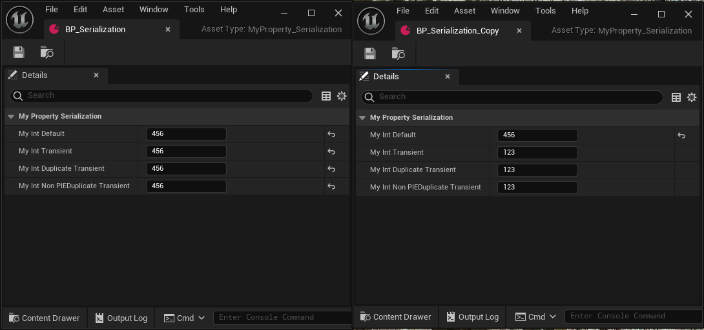
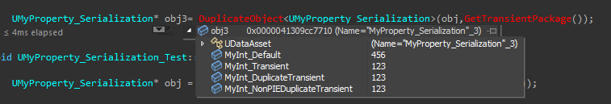

# DuplicateTransient

Type: bool
Feature: Serialization
Description: 说明在任意类型的复制中（复制/粘贴、二进制复制等），属性的值应被重设为类默认值。在复制的时候，该属性不被复制。
意味着该属性在备复制后是用默认值。
Status: Done

在文本导出的时候：

如果是T3D格式，则依然会导出。如果是COPY格式，则不导出。

```cpp
bool FProperty::ShouldPort( uint32 PortFlags/*=0*/ ) const
{
// if we're copying, treat DuplicateTransient as transient
	if ((PortFlags & PPF_Copy) && HasAnyPropertyFlags(CPF_DuplicateTransient | CPF_TextExportTransient) && !(PortFlags & (PPF_ParsingDefaultProperties | PPF_IncludeTransient)))
	{
		return false;
	}
}
```

在二进制序列化的时候：

只有在PPF_Duplicate生效的时候，（DuplicateObject?或者资产复制），才会跳过该属性

```cpp
bool FProperty::ShouldSerializeValue(FArchive& Ar) const
{
// Skip properties marked DuplicateTransient when duplicating
	if ((PropertyFlags & CPF_DuplicateTransient) && (Ar.GetPortFlags() & PPF_Duplicate))
	{
		return false;
	}
}
```

在对资产进行Duplidate的时候，发生DuplicateAsset然后DuplicateObject，这个时候PortFlags=PPF_Duplicate，然后会触发ShouldSerializeValue进行判断。这个时候会跳过该属性

可以看到DuplicateTransient并不会被复制



在采用C++复制的时候：也看到并不会产生复制。

