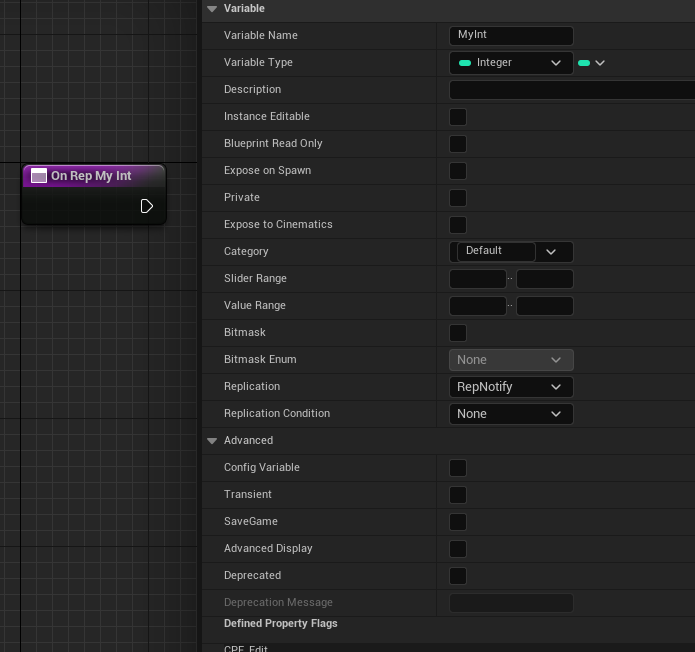

# ReplicatedUsing

Description: ReplicatedUsing 说明符指定一个通知回调函数，在属性通过网络更新后执行。
Type: string="abc"
Feature: Network
Example: ReplicatedUsing=FunctionName
EPropertyFlags: CPF_Net (../../Flags/EPropertyFlags/CPF_Net.md), CPF_RepNotify (../../Flags/EPropertyFlags/CPF_RepNotify.md)
Status: Done

ReplicatedUsing 可以接受无参数的函数，或是带一个参数的函数表示旧值。一般在OnRep函数里，做一些开启关闭的相应操作，比如enabled的复制就会触发相应的后续逻辑。

测试代码：

```jsx
UCLASS(Blueprintable, BlueprintType)
class INSIDER_API AMyProperty_Network :public AActor
{
public:
	GENERATED_BODY()
protected:
	UFUNCTION()
		void OnRep_MyInt(int32 oldValue);
UPROPERTY(EditAnywhere, BlueprintReadWrite, ReplicatedUsing = OnRep_MyInt)
		int32 MyInt_ReplicatedUsing = 123;
};

void AMyProperty_Network::GetLifetimeReplicatedProps(TArray<FLifetimeProperty>& OutLifetimeProps) const
{
	Super::GetLifetimeReplicatedProps(OutLifetimeProps);
	DOREPLIFETIME(AMyProperty_Network, MyInt_ReplicatedUsing);
}
```

在蓝图中等价于：

