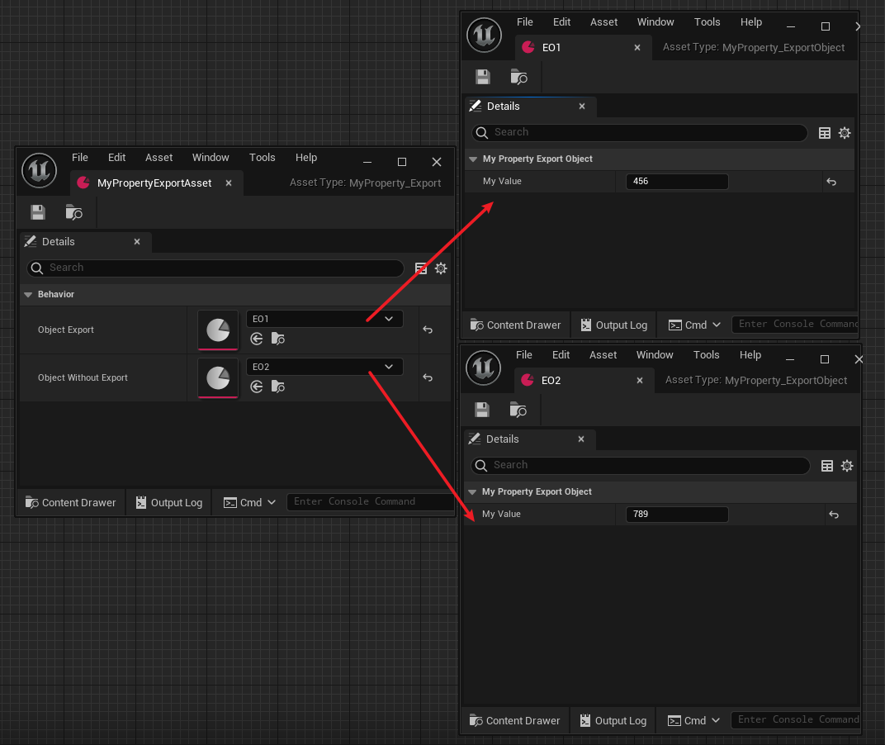

# Export

- **功能描述：**在对Asset导出的时候，决定该类的对象应该导出内部的属性值，而是对象的路径。
- **元数据类型：**bool
- **引擎模块：**Serialization
- **限制类型：**Object属性，或Object数组
- **作用机制：**在PropertyFlags中加入[CPF_ExportObject](../../../../Flags/EPropertyFlags/CPF_ExportObject.md)
- **常用程度：**★

在对Asset导出的时候，决定该类的对象应该导出内部的属性值，而是对象的路径。

- 说明Object被复制时（例如复制/粘贴操作）指定到此属性的Object应整体导出为一个子Object块（后文的例子里会看到，其实就是也输出内部属性的值），而非只是输出Object引用本身。
- 只适用于Object属性（或Object数组），因为是用在对象的导出的上的。
- 其实就是浅复制和深复制的区别。不标Export就是浅复制，只输出对象路径。标上Export后是深复制，也输出对象的内部属性。

## 示例代码：

```jsx
UCLASS(Blueprintable, BlueprintType)
class INSIDER_API UMyProperty_ExportObject :public UDataAsset
{
public:
	GENERATED_BODY()
public:
	UPROPERTY(EditAnywhere, BlueprintReadWrite)
		int32 MyValue = 123;
};

UCLASS(Blueprintable, BlueprintType)
class INSIDER_API UMyProperty_Export :public UDataAsset
{
public:
public:
	GENERATED_BODY()
		UMyProperty_Export(const FObjectInitializer& ObjectInitializer = FObjectInitializer::Get());
public:
	//PropertyFlags:	CPF_Edit | CPF_BlueprintVisible | CPF_ExportObject | CPF_ZeroConstructor | CPF_NoDestructor | CPF_HasGetValueTypeHash | CPF_NativeAccessSpecifierPublic 
	UPROPERTY(EditAnywhere, BlueprintReadWrite, Export, Category = Behavior)
		UMyProperty_ExportObject* ObjectExport;
	UPROPERTY(EditAnywhere, BlueprintReadWrite, Category = Behavior)
		UMyProperty_ExportObject* ObjectWithoutExport;
};
```

配置的对象值：



主要是用在Export 操作的时候，用来决定如何导出Object*属性的内容。NoExport的话是只输出对象引用的路径，而Export的话会输出这个对象其再内部的的属性值。


导出的文本：

```jsx
Begin Object Class=/Script/Insider.MyProperty_Export Name="MyPropertyExportAsset" ExportPath=/Script/Insider.MyProperty_Export'"/Game/Property/MyPropertyExportAsset.MyPropertyExportAsset"'
   Begin Object Class=/Script/Insider.MyProperty_ExportObject Name="EO1" ExportPath=/Script/Insider.MyProperty_ExportObject'"/Game/Property/EO1.EO1"'
      "MyValue"=456
   End Object
   "ObjectExport"=/Script/Insider.MyProperty_ExportObject'"/Game/Property/EO1.EO1"'
   "ObjectWithoutExport"=/Script/Insider.MyProperty_ExportObject'"/Game/Property/EO2.EO2"'
End Object
```

可以看到ObjectExport的对象也导出的字段值，但是ObjectWithoutExport只有路径。

## 原理：

源码内作用的函数，要注意一点的是，要让Export标记在ExportProperties起作用，export标记不能用在对象的sub object上，否则会走ExportInnerObjects的调用路线。上面例子中ObjectExport和ObjectWithoutExport都是指向了外部的另外一个对象，所以用DataAsset来产生资产。

```cpp
void ExportProperties()
{
	FObjectPropertyBase* ExportObjectProp = (Property->PropertyFlags & CPF_ExportObject) != 0 ? CastField<FObjectPropertyBase>(Property) : NULL;
}
```