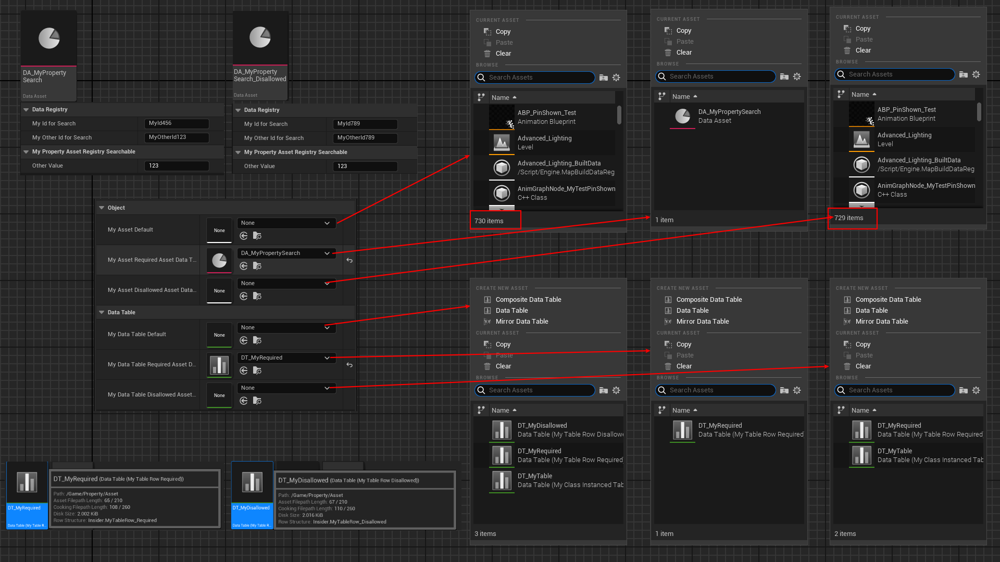

# RequiredAssetDataTags

- **Function description:** Specifies tags on the UObject* attribute for filtering; an object must possess these tags to be selected.
- **Usage location:** UPROPERTY
- **Engine module:** Asset Property
- **Metadata type:** strings = "a=b, c=d, e=f"
- **Restriction type:** UObject*
- **Associated items:** [DisallowedAssetDataTags](../DisallowedAssetDataTags.md), [AssetRegistrySearchable](../../../Specifier/UPROPERTY/Asset/AssetRegistrySearchable/AssetRegistrySearchable.md)
- **Commonly used:** ★★

Specifies tags on the UObject* attribute for filtering; an object must possess these tags to be selected.

Refer to the AssetRegistrySearchable specifier and the GetAssetRegistryTags method for related information.

## Test Code:

```cpp
USTRUCT(BlueprintType)
struct INSIDER_API FMyTableRow_Required :public FTableRowBase
{
	GENERATED_BODY()
public:
	UPROPERTY(BlueprintReadWrite, EditAnywhere)
	int32 MyInt = 123;
	UPROPERTY(BlueprintReadWrite, EditAnywhere)
	FString MyString;
};

USTRUCT(BlueprintType)
struct INSIDER_API FMyTableRow_Disallowed :public FTableRowBase
{
	GENERATED_BODY()
public:
	UPROPERTY(BlueprintReadWrite, EditAnywhere)
	float MyFloat = 123.f;
	UPROPERTY(BlueprintReadWrite, EditAnywhere)
	UTexture2D* MyTexture;
};

UCLASS(Blueprintable, BlueprintType)
class INSIDER_API UMyProperty_AssetDataTags :public UDataAsset
{
public:
	GENERATED_BODY()
public:
	UPROPERTY(EditAnywhere, BlueprintReadWrite, Category = Object)
	TObjectPtr<UObject> MyAsset_Default;

	UPROPERTY(EditAnywhere, BlueprintReadWrite, Category = Object, meta = (RequiredAssetDataTags = "MyIdForSearch=MyId456"))
	TObjectPtr<UObject> MyAsset_RequiredAssetDataTags;

	UPROPERTY(EditAnywhere, BlueprintReadWrite, Category = Object, meta = (DisallowedAssetDataTags = "MyOtherId=MyOtherId789"))
	TObjectPtr<UObject> MyAsset_DisallowedAssetDataTags;
public:
	UPROPERTY(EditAnywhere, Category = DataTable)
	TObjectPtr<class UDataTable> MyDataTable_Default;

	UPROPERTY(EditAnywhere, Category = DataTable, meta = (RequiredAssetDataTags = "RowStructure=/Script/Insider.MyTableRow_Required"))
	TObjectPtr<class UDataTable> MyDataTable_RequiredAssetDataTags;

	UPROPERTY(EditAnywhere, Category = DataTable, meta = (DisallowedAssetDataTags = "RowStructure=/Script/Insider.MyTableRow_Disallowed"))
	TObjectPtr<class UDataTable> MyDataTable_DisallowedAssetDataTags;
};
```

## Test Results:

As seen in the code above, two different types of FTableRowBase are defined, and two DataTables are created. There are also two DataAssets (structures defined in the AssetRegistrySearchable example) that both have the MyIdForSearch and MyOtherId tags, but with different values to distinguish them.

- MyAsset_Default can filter out all objects, with 730 examples shown in the image.
- MyAsset_RequiredAssetDataTags filters out all but DA_MyPropertySearch, because MyIdForSearch equals MyId456.
- MyAsset_DisallowedAssetDataTags filters out DA_MyPropertySearch_Disallowed, because the configured MyOtherId equals MyOtherId789, leaving only 729.
- The same logic applies to DataTable. MyDataTable_Default can retrieve all DataTables (there are three), while MyDataTable_RequiredAssetDataTags restricts RowStructure to only FMyTableRow_Required (thus filtering out one). MyDataTable_DisallowedAssetDataTags excludes any RowStructure that is FMyTableRow_Disallowed, leaving only two.



## Example in Source Code:

```cpp
	UPROPERTY(Category="StateTree", EditAnywhere, meta=(RequiredAssetDataTags="Schema=/Script/MassAIBehavior.MassStateTreeSchema"))
	TObjectPtr<UStateTree> StateTree;

	UPROPERTY(EditAnywhere, Category=Appearance, meta = (RequiredAssetDataTags = "RowStructure=/Script/UMG.RichImageRow"))
	TObjectPtr<class UDataTable> ImageSet;

	UPROPERTY(EditAnywhere, BlueprintReadWrite, Category=Compositing, meta = (AllowPrivateAccess, RequiredAssetDataTags = "IsSourceValid=True"), Setter = SetCompositeTexture, Getter = GetCompositeTexture)
	TObjectPtr<class UTexture> CompositeTexture;
```

## Principle:

The configuration of RequiredAssetDataTags and DisallowedAssetDataTags on the UObject* attribute is parsed and extracted into its member variables, RequiredAssetDataTags and DisallowedAssetDataTags, during the attribute editor (SPropertyEditorAsset) initialization.  Essentially, it's a key-value pair. When performing asset filtering later (during the call to IsAssetFiltered), the Tags in FAssetData are matched against the attribute's Tags requirements.  Assets with Disallowed Tags are excluded, while those lacking Required Tags are also filtered out. This achieves the desired filtering effect.

For information about the tags in FAssetData, refer to the AssetRegistrySearchable specifier and the usage of the GetAssetRegistryTags method. In essence, there is a method on the object that actively provides tags to the AssetRegistry.

The reason why DataTables can be filtered by RowStructure can be understood by examining the GetAssetRegistryTags method in DataTables, which actively registers the RowStructure tags.

```cpp
FAssetDataTagMapBase=TSortedMap<FName, FString, FDefaultAllocator, FNameFastLess>;

SPropertyEditorAsset::
	/** Tags (and eventually values) that can NOT be used with this property */
	TSharedPtr<FAssetDataTagMap> DisallowedAssetDataTags;

	**/** Tags and values that must be present for an asset to be used with this property */
	TSharedPtr<FAssetDataTagMap> RequiredAssetDataTags;

void SPropertyEditorAsset::InitializeAssetDataTags(const FProperty* Property)
{
	if (Property == nullptr)
{
	return;
}

const FProperty* MetadataProperty = GetActualMetadataProperty(Property);
const FString DisallowedAssetDataTagsFilterString = MetadataProperty->GetMetaData("DisallowedAssetDataTags");
if (!DisallowedAssetDataTagsFilterString.IsEmpty())
{
	TArray<FString> DisallowedAssetDataTagsAndValues;
	DisallowedAssetDataTagsFilterString.ParseIntoArray(DisallowedAssetDataTagsAndValues, TEXT(","), true);

	for (const FString& TagAndOptionalValueString : DisallowedAssetDataTagsAndValues)
	{
		TArray<FString> TagAndOptionalValue;
		TagAndOptionalValueString.ParseIntoArray(TagAndOptionalValue, TEXT("="), true);
		size_t NumStrings = TagAndOptionalValue.Num();
		check((NumStrings == 1) || (NumStrings == 2)); // there should be a single '=' within a tag/value pair

		if (!DisallowedAssetDataTags.IsValid())
		{
			DisallowedAssetDataTags = MakeShared<FAssetDataTagMap>();
		}
		DisallowedAssetDataTags->Add(FName(*TagAndOptionalValue[0]), (NumStrings > 1) ? TagAndOptionalValue[1] : FString());
	}
}

const FString RequiredAssetDataTagsFilterString = MetadataProperty->GetMetaData("RequiredAssetDataTags");
if (!RequiredAssetDataTagsFilterString.IsEmpty())
{
	TArray<FString> RequiredAssetDataTagsAndValues;
	RequiredAssetDataTagsFilterString.ParseIntoArray(RequiredAssetDataTagsAndValues, TEXT(","), true);

	for (const FString& TagAndOptionalValueString : RequiredAssetDataTagsAndValues)
	{
		TArray<FString> TagAndOptionalValue;
		TagAndOptionalValueString.ParseIntoArray(TagAndOptionalValue, TEXT("="), true);
		size_t NumStrings = TagAndOptionalValue.Num();
		check((NumStrings == 1) || (NumStrings == 2)); // there should be a single '=' within a tag/value pair

		if (!RequiredAssetDataTags.IsValid())
		{
			RequiredAssetDataTags = MakeShared<FAssetDataTagMap>();
		}
		RequiredAssetDataTags->Add(FName(*TagAndOptionalValue[0]), (NumStrings > 1) ? TagAndOptionalValue[1] : FString());
	}
}
}

bool SPropertyEditorAsset::IsAssetFiltered(const FAssetData& InAssetData)
{
//Judgment is made that the presence of tags does not meet the criteria
	if (DisallowedAssetDataTags.IsValid())
	{
		for (const auto& DisallowedTagAndValue : *DisallowedAssetDataTags.Get())
		{
			if (InAssetData.TagsAndValues.ContainsKeyValue(DisallowedTagAndValue.Key, DisallowedTagAndValue.Value))
			{
				return true;
			}
		}
	}
	//Judgment is made that the presence of tags is required to avoid being filtered out
	if (RequiredAssetDataTags.IsValid())
	{
		for (const auto& RequiredTagAndValue : *RequiredAssetDataTags.Get())
		{
			if (!InAssetData.TagsAndValues.ContainsKeyValue(RequiredTagAndValue.Key, RequiredTagAndValue.Value))
			{
				// For backwards compatibility compare against short name version of the tag value.
				if (!FPackageName::IsShortPackageName(RequiredTagAndValue.Value) &&
					InAssetData.TagsAndValues.ContainsKeyValue(RequiredTagAndValue.Key, FPackageName::ObjectPathToObjectName(RequiredTagAndValue.Value)))
				{
					continue;
				}
				return true;
			}
		}
	}
	return false;
}

void UDataTable::GetAssetRegistryTags(FAssetRegistryTagsContext Context) const
{
	if (AssetImportData)
	{
		Context.AddTag( FAssetRegistryTag(SourceFileTagName(), AssetImportData->GetSourceData().ToJson(), FAssetRegistryTag::TT_Hidden) );
	}

	// Add the row structure tag
	{
		static const FName RowStructureTag = "RowStructure";
		Context.AddTag( FAssetRegistryTag(RowStructureTag, GetRowStructPathName().ToString(), FAssetRegistryTag::TT_Alphabetical) );
	}

	Super::GetAssetRegistryTags(Context);
}

```