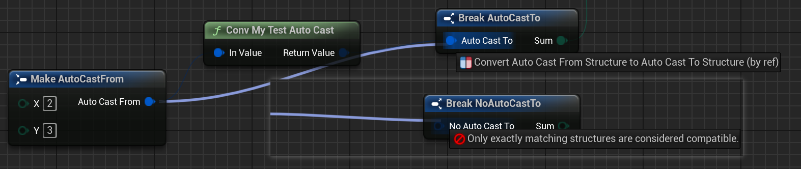

# BlueprintAutocast

- **Function Description:** Instruct the blueprint system that this function facilitates automatic conversion from type A to type B.
- **Usage Location:** UFUNCTION
- **Engine Module:** Blueprint
- **Metadata Type:** bool
- **Commonality:** ★

Inform the blueprint system that this function facilitates automatic conversion from type A to type B.

Automatic conversion refers to the process where, when dragging a Pin of type A to a Pin of type B, the blueprint automatically generates a type conversion node.

This conversion function must be marked as BlueprintPure, as it is invoked passively without an active execution node.

## Test Code:

```cpp
USTRUCT(BlueprintType)
struct FAutoCastFrom
{
	GENERATED_BODY()
public:
	UPROPERTY(BlueprintReadWrite, EditAnywhere)
	int32 X = 0;
	UPROPERTY(BlueprintReadWrite, EditAnywhere)
	int32 Y = 0;
};

USTRUCT(BlueprintType)
struct FAutoCastTo
{
	GENERATED_BODY()
public:
	UPROPERTY(BlueprintReadWrite, EditAnywhere)
	int32 Sum = 0;
};

USTRUCT(BlueprintType)
struct FNoAutoCastTo
{
	GENERATED_BODY()
public:
	UPROPERTY(BlueprintReadWrite, EditAnywhere)
	int32 Sum = 0;
};

UCLASS(Blueprintable, BlueprintType)
class INSIDER_API UMyFunction_AutoCast :public UBlueprintFunctionLibrary
{
public:
	GENERATED_BODY()
public:
	UFUNCTION(BlueprintPure, meta = (BlueprintAutocast))
	static FAutoCastTo Conv_MyTestAutoCast(const FAutoCastFrom& InValue);
};

//Conversion functions are frequently paired with CompactNodeTitle for use.
UFUNCTION(BlueprintPure, Category="Widget", meta = (CompactNodeTitle = "->", BlueprintAutocast))
static UMG_API FInputEvent GetInputEventFromKeyEvent(const FKeyEvent& Event);
```

## Example Effect:

FAutoCastTo, which supports automatic conversion, automatically generates nodes during the connection drag operation, whereas FNoAutoCastTo, lacking an automatic conversion function, will result in an error.



## Principle Code:

It is evident that the function must be static, a public C++ function, marked with BlueprintPure, have a return value, and include an input parameter. The automatic conversion relationships between types in the engine are maintained by the FAutocastFunctionMap.

```cpp
static bool IsAutocastFunction(const UFunction* Function)
{
	const FName BlueprintAutocast(TEXT("BlueprintAutocast"));
	return Function
		&& Function->HasMetaData(BlueprintAutocast)
		&& Function->HasAllFunctionFlags(FUNC_Static | FUNC_Native | FUNC_Public | FUNC_BlueprintPure)
		&& Function->GetReturnProperty()
		&& GetFirstInputProperty(Function);
}
```