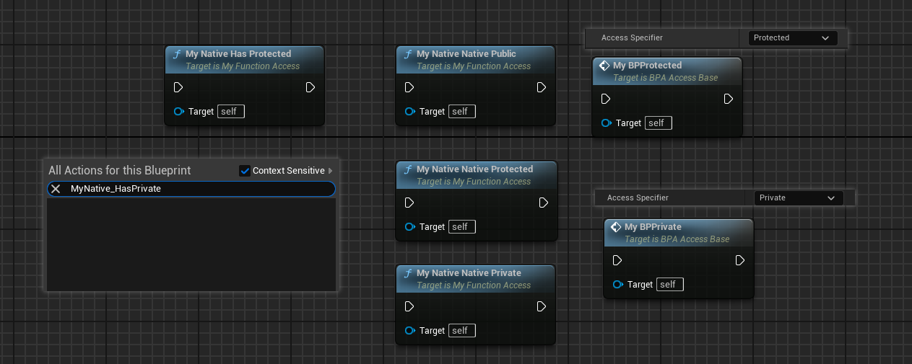

# BlueprintProtected

- **Function description:** Specifies that the function or attribute can only be called or accessed for reading and writing within this class and its subclasses, akin to the protected scope restriction in C++. It is not accessible from other Blueprint classes.
- **Usage location:** UFUNCTION, UPROPERTY
- **Engine module:** Blueprint
- **Metadata type:** bool
- **Related items:** [BlueprintPrivate](../BlueprintPrivate/BlueprintPrivate.md), [AllowPrivateAccess](../AllowPrivateAccess/AllowPrivateAccess.md)
- **Commonality:** ★★★

Effect on functions:

Indicates that the function can only be invoked within this class and its subclasses, similar to the scope restriction of protected functions in C++. It cannot be invoked from other Blueprint classes.

When applied to an attribute, it signifies that the attribute can only be read and written within this class or its derived classes, but not accessible from other Blueprint classes.

Specifies that the function or attribute can only be called or accessed for reading and writing within this class and its subclasses, similar to the protected scope restriction in C++. It is not accessible from other Blueprint classes.

## Test code:

```cpp
UCLASS(Blueprintable, BlueprintType)
class INSIDER_API AMyFunction_Access :public AActor
{
public:
	GENERATED_BODY()
public:
	//(BlueprintProtected = true, ModuleRelativePath = Function/MyFunction_Access.h)
	//FUNC_Final | FUNC_Native | FUNC_Public | FUNC_BlueprintCallable
	UFUNCTION(BlueprintCallable, meta = (BlueprintProtected = "true"))
	void MyNative_HasProtected() {}

	//(BlueprintPrivate = true, ModuleRelativePath = Function/MyFunction_Access.h)
	//FUNC_Final | FUNC_Native | FUNC_Public | FUNC_BlueprintCallable
	UFUNCTION(BlueprintCallable, meta = (BlueprintPrivate = "true"))
	void MyNative_HasPrivate() {}
public:
	//FUNC_Final | FUNC_Native | FUNC_Public | FUNC_BlueprintCallable
	UFUNCTION(BlueprintCallable)
	void MyNative_NativePublic() {}
protected:
	//FUNC_Final | FUNC_Native | FUNC_Protected | FUNC_BlueprintCallable
	UFUNCTION(BlueprintCallable)
	void MyNative_NativeProtected() {}
private:
	//FUNC_Final | FUNC_Native | FUNC_Private | FUNC_BlueprintCallable
	UFUNCTION(BlueprintCallable)
	void MyNative_NativePrivate() {}
};

```

## Test results:

Effect in Blueprint subclass (BPA_Access_Base inheriting from AMyFunction_Access):

BlueprintProtected can be invoked by subclasses, but BlueprintPrivate can only be called within the class itself (those defined in C++ classes can only be called in C++, and those defined in Blueprints can only be called within the Blueprint class itself). Functions marked with protected or private in C++ will accordingly increase FUNC_Protected or FUNC_Private, but they do not actually take effect. This is because the design intent of the mechanism is as such (see detailed explanation below).

MyBPProtected and MyBPPrivate, defined directly in BPA_Access_Base, can be called within the class by setting the AccessSpecifier directly in the function details panel, but MyBPPrivate cannot be called in further Blueprint subclasses.



Effect in Blueprint subclass (BPA_Access_Child inheriting from BPA_Access_Base):

It can be observed that the access to MyNative functions remains the same. MyBPPrivate cannot be called, aligning with our expected rules.


In external classes (BPA_Access_Other, inheriting from Actor), when accessing functions through BPA_Access_Base or BPA_Access_Child object instances, it is found that neither BlueprintProtected nor BlueprintPrivate can be called. Only functions with the default Public AccessSpecifier can be called. This rule also aligns with expectations.


## Principle:

Is it possible to select the filtering logic for this function by right-clicking in the Blueprint:

If it is a static function, it is always possible. Otherwise, there must be no BlueprintProtected or BlueprintPrivate for it to be selectable as Public.

If it is Private, the external class must be the class itself.

If it is Protected, the external class only needs to be the class itself or a subclass.

```cpp
static bool BlueprintActionFilterImpl::IsFieldInaccessible(FBlueprintActionFilter const& Filter, FBlueprintActionInfo& BlueprintAction)
{
		bool const bIsProtected = Field.HasMetaData(FBlueprintMetadata::MD_Protected);
		bool const bIsPrivate   = Field.HasMetaData(FBlueprintMetadata::MD_Private);
		bool const bIsPublic    = !bIsPrivate && !bIsProtected;

		if( !bIsPublic )
		{
			UClass const* ActionOwner = BlueprintAction.GetOwnerClass();
			for (UBlueprint const* Blueprint : FilterContext.Blueprints)
			{
				UClass const* BpClass = GetAuthoritativeBlueprintClass(Blueprint);
				if (!ensureMsgf(BpClass != nullptr
					, TEXT("Unable to resolve IsFieldInaccessible() - Blueprint (%s) missing an authoratative class (skel: %s, generated: %s, parent: %s)")
					, *Blueprint->GetName()
					, Blueprint->SkeletonGeneratedClass ? *Blueprint->SkeletonGeneratedClass->GetName() : TEXT("[NULL]")
					, Blueprint->GeneratedClass ? *Blueprint->GeneratedClass->GetName() : TEXT("[NULL]")
					, Blueprint->ParentClass ? *Blueprint->ParentClass->GetName() : TEXT("[NULL]")))
				{
					continue;
				}

				// private functions are only accessible from the class they belong to
				if (bIsPrivate && !IsClassOfType(BpClass, ActionOwner, /*bNeedsExactMatch =*/true))
				{
					bIsFilteredOut = true;
					break;
				}
				else if (bIsProtected && !IsClassOfType(BpClass, ActionOwner))
				{
					bIsFilteredOut = true;
					break;
				}
			}
		}
}

bool UEdGraphSchema_K2::ClassHasBlueprintAccessibleMembers(const UClass* InClass) const
{
	// @TODO Don't show other blueprints yet...
	UBlueprint* ClassBlueprint = UBlueprint::GetBlueprintFromClass(InClass);
	if (!InClass->HasAnyClassFlags(CLASS_Deprecated | CLASS_NewerVersionExists) && (ClassBlueprint == NULL))
	{
		// Find functions
		for (TFieldIterator<UFunction> FunctionIt(InClass, EFieldIteratorFlags::IncludeSuper); FunctionIt; ++FunctionIt)
		{
			UFunction* Function = *FunctionIt;
			const bool bIsBlueprintProtected = Function->GetBoolMetaData(FBlueprintMetadata::MD_Protected);
			const bool bHidden = FObjectEditorUtils::IsFunctionHiddenFromClass(Function, InClass);
			if (UEdGraphSchema_K2::CanUserKismetCallFunction(Function) && !bIsBlueprintProtected && !bHidden)
			{
				return true;
			}
		}

		// Find vars
		for (TFieldIterator<FProperty> PropertyIt(InClass, EFieldIteratorFlags::IncludeSuper); PropertyIt; ++PropertyIt)
		{
			FProperty* Property = *PropertyIt;
			if (CanUserKismetAccessVariable(Property, InClass, CannotBeDelegate))
			{
				return true;
			}
		}
	}

	return false;
}
```

If a function defined in BP is set to Protected or Private through AccessSpecifier, the function will be added accordingly with FUNC_Protected or FUNC_Private. This actually affects the function's scope. However, many checks in the source code will first determine if it is a Native function, and if so, no further restrictions are applied. Therefore, we can understand that this is an intentional design choice by UE, not considering C++ protected and private scopes, and requiring explicit manual marking of BlueprintProtected or BlueprintPrivate to avoid ambiguity.

```cpp
bool UEdGraphSchema_K2::CanFunctionBeUsedInGraph(const UClass* InClass, const UFunction* InFunction, const UEdGraph* InDestGraph, uint32 InAllowedFunctionTypes, bool bInCalledForEach, FText* OutReason) const
{
	const bool bIsNotNative = !FBlueprintEditorUtils::IsNativeSignature(InFunction);
	if(bIsNotNative)
	{
		// Blueprint functions visibility flags can be enforced in blueprints - native functions
		// are often using these flags to only hide functionality from other native functions:
		const bool bIsProtected = (InFunction->FunctionFlags & FUNC_Protected) != 0;
}

bool UK2Node_CallFunction::IsActionFilteredOut(FBlueprintActionFilter const& Filter)
{
	bool bIsFilteredOut = false;
	for(UEdGraph* TargetGraph : Filter.Context.Graphs)
	{
		bIsFilteredOut |= !CanPasteHere(TargetGraph);
	}

	if(const UFunction* TargetFunction = GetTargetFunction())
	{
		const bool bIsProtected = (TargetFunction->FunctionFlags & FUNC_Protected) != 0;
		const bool bIsPrivate = (TargetFunction->FunctionFlags & FUNC_Private) != 0;
		const UClass* OwningClass = TargetFunction->GetOwnerClass();
		if( (bIsProtected || bIsPrivate) && !FBlueprintEditorUtils::IsNativeSignature(TargetFunction) && OwningClass)
		{
			OwningClass = OwningClass->GetAuthoritativeClass();
			// we can filter private and protected blueprints that are unrelated:
			bool bAccessibleInAll = true;
			for (const UBlueprint* Blueprint : Filter.Context.Blueprints)
			{
				UClass* AuthoritativeClass = Blueprint->GeneratedClass;
				if(!AuthoritativeClass)
				{
					continue;
				}

				if(bIsPrivate)
				{
					bAccessibleInAll = bAccessibleInAll && AuthoritativeClass == OwningClass;
				}
				else if(bIsProtected)
				{
					bAccessibleInAll = bAccessibleInAll && AuthoritativeClass->IsChildOf(OwningClass);
				}
			}

			if(!bAccessibleInAll)
			{
				bIsFilteredOut = true;
			}
		}
	}

	return bIsFilteredOut;
}
```

# Effect on attributes:

When applied to an attribute, it indicates that the attribute can only be read and written within this class or its derived classes, but not accessible from other Blueprint classes.

Test code:

```cpp
UCLASS(Blueprintable, BlueprintType)
class INSIDER_API AMyFunction_Access :public AActor
{
public:
	GENERATED_BODY()
public:
	//(BlueprintProtected = true, Category = MyFunction_Access, ModuleRelativePath = Function/MyFunction_Access.h)
	//CPF_BlueprintVisible | CPF_ZeroConstructor | CPF_IsPlainOldData | CPF_NoDestructor | CPF_HasGetValueTypeHash | CPF_NativeAccessSpecifierPublic
	UPROPERTY(BlueprintReadWrite,meta = (BlueprintProtected = "true"))
	int32 MyNativeInt_HasProtected;

	//(BlueprintPrivate = true, Category = MyFunction_Access, ModuleRelativePath = Function/MyFunction_Access.h)
	//CPF_BlueprintVisible | CPF_ZeroConstructor | CPF_IsPlainOldData | CPF_NoDestructor | CPF_HasGetValueTypeHash | CPF_NativeAccessSpecifierPublic
	UPROPERTY(BlueprintReadWrite,meta = (BlueprintPrivate = "true"))
	int32 MyNativeInt_HasPrivate;

public:
//CPF_BlueprintVisible | CPF_ZeroConstructor | CPF_IsPlainOldData | CPF_NoDestructor | CPF_HasGetValueTypeHash | CPF_NativeAccessSpecifierPublic
	UPROPERTY(BlueprintReadWrite)
	int32 MyNativeInt_NativePublic;
protected:
	//CPF_BlueprintVisible | CPF_ZeroConstructor | CPF_IsPlainOldData | CPF_NoDestructor | CPF_Protected | CPF_HasGetValueTypeHash | CPF_NativeAccessSpecifierProtected
	UPROPERTY(BlueprintReadOnly)
	int32 MyNativeInt_NativeProtected;
private:
	//CPF_Edit | CPF_ZeroConstructor | CPF_IsPlainOldData | CPF_NoDestructor | CPF_HasGetValueTypeHash | CPF_NativeAccessSpecifierPrivate
	//error : BlueprintReadWrite should not be used on private members
	UPROPERTY(EditAnywhere)
	int32 MyNativeInt_NativePrivate;
};
```

Blueprint effect:

In testing with the subclass BPA_Access_Base, it was found that all attributes except MyNativeInt_HasPrivate can be accessed. This is logical, as the meaning of Private is that it can only be accessed within the class itself.

Because MyBPIntPrivate, defined in this Blueprint class, is checked as Private, the property will add the meta BlueprintPrivate = true, but since it is defined within this class, it can still be read and written within this class.


Continuing with the subclass effect in the Blueprint (BPA_Access_Child inheriting from BPA_Access_Base):

Protected attributes are still accessible, but the MyBPIntPrivate attribute cannot be read or written because it is Private. If the node is forcibly pasted, an error will be reported during compilation. Private means that it can only be accessed within the class itself.


In external classes (BPA_Access_Other, inheriting from Actor), when accessing properties through BPA_Access_Base or BPA_Access_Child object instances: neither BlueprintProtected nor BlueprintPrivate can be accessed. C++ protected attributes have no effect.

MyBPIntPrivate cannot be accessed because it is Private.


## Principle:

Searching the source code for CPF_NativeAccessSpecifierProtected reveals no usage.

And CPF_NativeAccessSpecifierPrivate is only referenced in IsPropertyPrivate, and the latter is only detected during thread safety checks in Blueprint compilation. Therefore, CPF_NativeAccessSpecifierPrivate is not actually used as a scope restriction.

Combining the two, this is also the reason why protected and private in C++ do not affect Blueprints. However, UHT will prevent BlueprintReadWrite or BlueprintReadOnly on private variables, making them effectively inaccessible in Blueprints, achieving the effect that C++ base class private variables cannot be accessed in Blueprint subclasses.

Therefore, in fact, the variable scope control in the blueprint uses metadata BlueprintProtected and BlueprintPrivate . The logic of whether the attribute read-write node can be created by right-clicking on the blueprint is reflected in the BlueprintActionFilterImpl::IsFieldInaccessible function above. When compiling, the logic to determine whether an attribute is readable and writable lies in these two functions IsPropertyWritableInBlueprint and IsPropertyReadableInBlueprint . If the final status result is Private , it means it is inaccessible. The UK2Node_VariableGet UK2Node_VariableSet ValidateNodeDuringCompilation will be detected and an error will be reported.

```cpp
bool FBlueprintEditorUtils::IsPropertyPrivate(const FProperty* Property)
{
	return Property->HasAnyPropertyFlags(CPF_NativeAccessSpecifierPrivate) || Property->GetBoolMetaData(FBlueprintMetadata::MD_Private);
}

FBlueprintEditorUtils::EPropertyWritableState FBlueprintEditorUtils::IsPropertyWritableInBlueprint(const UBlueprint* Blueprint, const FProperty* Property)
{
	if (Property)
	{
		if (!Property->HasAnyPropertyFlags(CPF_BlueprintVisible))
		{
			return EPropertyWritableState::NotBlueprintVisible;
		}
		if (Property->HasAnyPropertyFlags(CPF_BlueprintReadOnly))
		{
			return EPropertyWritableState::BlueprintReadOnly;
		}
		if (Property->GetBoolMetaData(FBlueprintMetadata::MD_Private))
		{
			const UClass* OwningClass = Property->GetOwnerChecked<UClass>();
			if (OwningClass->ClassGeneratedBy.Get() != Blueprint)
			{
				return EPropertyWritableState::Private;
			}
		}
	}
	return EPropertyWritableState::Writable;
}

FBlueprintEditorUtils::EPropertyReadableState FBlueprintEditorUtils::IsPropertyReadableInBlueprint(const UBlueprint* Blueprint, const FProperty* Property)
{
	if (Property)
	{
		if (!Property->HasAnyPropertyFlags(CPF_BlueprintVisible))
		{
			return EPropertyReadableState::NotBlueprintVisible;
		}
		if (Property->GetBoolMetaData(FBlueprintMetadata::MD_Private))
		{
			const UClass* OwningClass = Property->GetOwnerChecked<UClass>();
			if (OwningClass->ClassGeneratedBy.Get() != Blueprint)
			{
				return EPropertyReadableState::Private;
			}
		}
	}
	return EPropertyReadableState::Readable;
}
```