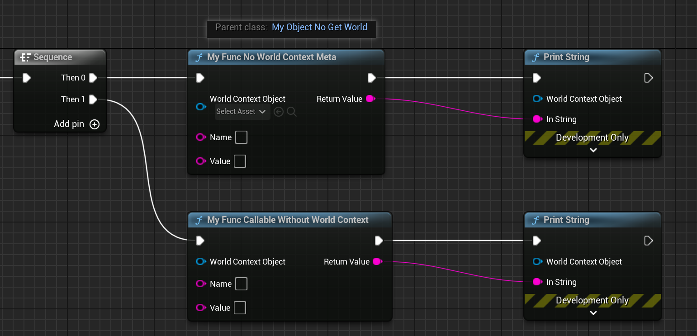

# CallableWithoutWorldContext

- **Function Description:** Allows a function to be used without depending on a WorldContextObject
- **Usage Location:** UFUNCTION
- **Metadata Type:** bool
- **Associated Items:** [WorldContext](../WorldContext/WorldContext.md)

Enables the function to be used without a WorldContextObject.

The CallableWithoutWorldContext attribute is used in conjunction with WorldContext or DefaultToSelf. These options require that a function be provided with an external WorldContext object to be invoked. Consequently, such functions cannot be called in object subclasses that lack the implementation of GetWorld. However, there are instances where certain functions do not necessarily need a WorldContextObject to operate, such as those in PrintString or VisualLogger.

## Test Code:

```cpp
UFUNCTION(BlueprintPure, meta = (WorldContext = "WorldContextObject"))
static FString MyFunc_HasWorldContextMeta(const UObject* WorldContextObject, FString name, FString value);

UFUNCTION(BlueprintCallable, meta = (WorldContext = "WorldContextObject",CallableWithoutWorldContext))
static FString MyFunc_CallableWithoutWorldContext(const UObject* WorldContextObject, FString name, FString value);

UCLASS(Blueprintable, BlueprintType)
class INSIDER_API UMyObject_NoGetWorld :public UObject
{
	GENERATED_BODY()
};
```

## Blueprint Test Effect:

In a subclass of UMyObject_NoGetWorld, MyFunc_HasWorldContextMeta cannot be invoked because its enclosing class is required to supply a WorldContextObject. On the other hand, MyFunc_CallableWithoutWorldContext can be called and does not require the provision of a WorldContextObject.



## Typical applications within the source code include:

```cpp
UFUNCTION(BlueprintCallable, meta=(WorldContext="WorldContextObject", CallableWithoutWorldContext, Keywords = "log print", AdvancedDisplay = "2", DevelopmentOnly), Category="Development")
static ENGINE_API void PrintString(const UObject* WorldContextObject, const FString& InString = FString(TEXT("Hello")), bool bPrintToScreen = true, bool bPrintToLog = true, FLinearColor TextColor = FLinearColor(0.0f, 0.66f, 1.0f), float Duration = 2.f, const FName Key = NAME_None);
```